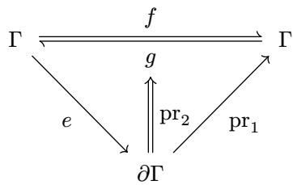
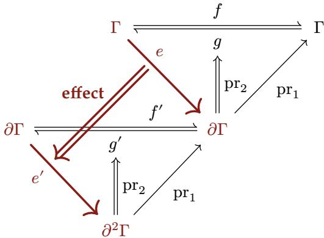

the same condition: the inverse e returns reverts the transformation at the state where e was applied:

Since effect functions $\mathfrak { E } _ { \Gamma }$ are no longer endomorphisms on the context, they cannot be directly composed. We therefore define a new operation for effect composition:

Definition 9. Given functions $f , g \in { \mathfrak { E } } _ { \Gamma } ,$ define their effect composition $f \diamond g$ as:

$$
\begin{array} { c c c c } { { f \diamond g } } & { { : } } & { { \Gamma } } & { { \to } } & { { \partial \Gamma } } \\ { { } } & { { } } & { { } } & { { { \bf k } { \bf \Lambda } ( \delta , s ) = g ( \gamma ) ~ { \bf i n } } } \\ { { f \diamond g } } & { { = } } & { { \gamma } } & { { \mapsto ~ { \bf \Lambda } { \bf k } { \bf t } ~ ( \varepsilon , t ) = f ( \delta ) ~ { \bf i n } } } \\ { { } } & { { } } & { { } } & { { ( \varepsilon , s ~ \circ t ) } } \end{array}\tag{13}
$$

Theorem 10. Effect composition carries the monoid structure of $\mathfrak { T } _ { \Gamma }$ over to $\mathfrak { E } _ { \Gamma }$ . That is,

1. $( { \mathfrak { E } } _ { \Gamma } , \circ )$ is a monoid with unit $\eta _ { \Gamma } : = \gamma \mapsto ( \gamma , \mathrm { i d } _ { \Gamma } ) ;$

2. the assignment $( f , g ) \mapsto \gamma \mapsto ( f ( \gamma ) , g )$ is a monoid homomorphism from $\mathfrak { T } _ { \Gamma }$ into $\mathfrak { E } _ { \Gamma }$

1. Associativity and the unit laws follow componentwise from those of $\circ _ { \bullet }$

2. Write $e _ { i } = \gamma \mapsto ( f _ { i } ( \gamma ) , g _ { i } ) .$ ; then $( e _ { 1 } \diamond e _ { 2 } ) ( \gamma ) = ( f _ { 1 } ( f _ { 2 } ( \gamma ) ) , g _ { 2 } \circ g _ { 1 } )$ , which is the image of $\left( f _ { 1 } , g _ { 1 } \right) \circ \left( f _ { 2 } , g _ { 2 } \right)$ , and $( \mathrm { i d } _ { \Gamma } , \mathrm { i d } _ { \Gamma } )$ maps to $\eta _ { \Gamma }$ □

Theorem 11. Witnessing survives effect composition, and a uniform inverse witnesses at every state. That is,

1. ${ \mathfrak { E } } _ { \Gamma } ^ { * }$ is a submonoid of $\mathfrak { E } _ { \Gamma } ;$

2. the homomorphism of Theorem 10 carries every pair with $g \circ f = \operatorname { i d } _ { \Gamma }$ into ${ \mathfrak { E } } _ { \Gamma } ^ { * }$

1. The unit lies in ${ \mathfrak { E } } _ { \Gamma } ^ { * }$ since $\operatorname { i d } _ { \Gamma } ( \gamma ) = \gamma$ . For closure, take $f , g \in { \mathfrak { E } } _ { \Gamma } ^ { * }$ and any $\gamma \in \Gamma$ , and let $( \delta , s ) = g ( \gamma ) , ( \varepsilon , t ) = f ( \delta )$ , so that $( f \diamond g ) ( \gamma ) = ( \varepsilon , s \circ t )$ . Then $s ( \delta ) = \gamma$ and $t ( \varepsilon ) = \delta ,$ therefore $( s \circ t ) ( \varepsilon ) = s ( \delta ) = \gamma$

2. $g \circ f = \operatorname { i d } _ { \Gamma } \operatorname { g i v e s } g ( f ( \gamma ) ) = \gamma$ at every γ, so the image of such a pair is witnessed at every state. □

Just as track lifts a pair of transformations on Γ to ∂Γ, we define effect to lift $\mathfrak { E } _ { \Gamma }$ to ${ \mathfrak { E } } _ { \partial \Gamma }$ ••

Definition 12. Define the effect function transformation effect as:

$$
\begin{array} { l l l l l l } { { \mathrm { e f f e c t } _ { \Gamma } } } & { { : } } & { { \mathfrak { E } _ { \Gamma } } } & { {  } } & { { \partial \Gamma } } & { {  } } & { { \partial ^ { 2 } \Gamma } } \\ { { } } & { { } } & { { } } & { { } } & { { } } & { { } } & { { } } \\ { { \mathrm { e f f e c t } _ { \Gamma } } } & { { = } } & { { e } } & { { \mapsto } } & { { ( \gamma , \varphi ) } } & { { \mapsto } } & { { \mathbf { l e t } \ ( \delta , g ) = e ( \gamma ) \ \mathbf { i n } } } \\ { { } } & { { } } & { { } } & { { } } & { { } } & { { \ ( ( \delta , \varphi \circ g ) , \mathrm { t r a c k } _ { \Gamma } ( g , \mathrm { p r } _ { 1 } \circ e ) ) } } \end{array}\tag{14}
$$

Since $\mathrm { e f f e c t } _ { \Gamma } ( e )$ is itself ${ \mathfrak { E } } _ { \partial \Gamma }$ , what it returns is an inverse in the sense of Definition 8 read one level up. That inverse is itself a track of the pair obtained by swapping the two directions of the effect. The ordinary tracking rule applies once more: undoing the effect is an effect in its

own right, transforming the state by ${ \mathit { g } } ,$ and the way to undo that is to perform the effect again, which is what $\mathrm { p r } _ { 1 } \circ e$ does. The inverse therefore composes onto the accumulator it is handed, exactly as track prescribes.

We can now prove properties for effect analogous to those of track.

Theorem 13. effect preserves the  operation. That is, $\forall f , g \in \mathfrak { E } _ { \Gamma }$

$$
\operatorname { e f f e c t } _ { \Gamma } ( f ) \diamond \operatorname { e f f e c t } _ { \Gamma } ( g ) = \operatorname { e f f e c t } _ { \Gamma } ( f \diamond g )\tag{15}
$$

Proof. Take any $( \gamma , \varphi ) \in \partial \Gamma$ , and let $( \delta , s ) = g ( \gamma )$ and $( \varepsilon , t ) = f ( \delta )$ , so that $( f \diamond g ) ( \gamma ) = ( \varepsilon , s \circ t )$ and $\operatorname { p r } _ { 1 } \circ ( f \circ g ) = ( \operatorname { p r } _ { 1 } \circ f ) \circ ( \operatorname { p r } _ { 1 } \circ g )$ . Then

$$
\begin{array} { r l } & { ( \mathrm { e f f e c t } _ { \Gamma } ( f ) \diamond \mathrm { e f f e c t } _ { \Gamma } ( g ) ) ( \gamma , \varphi ) = ( ( \varepsilon , \varphi \circ s \circ t ) , \mathrm { t r a c k } _ { \Gamma } ( s , \mathrm { p r } _ { 1 } \circ g ) \circ \mathrm { t r a c k } _ { \Gamma } ( t , \mathrm { p r } _ { 1 } \circ f ) ) } \\ & { \qquad = ( ( \varepsilon , \varphi \circ s \circ t ) , \mathrm { t r a c k } _ { \Gamma } ( s \circ t , ( \mathrm { p r } _ { 1 } \circ f ) \circ ( \mathrm { p r } _ { 1 } \circ g ) ) ) } \\ & { \qquad = \mathrm { e f f e c t } _ { \Gamma } ( f \circ g ) ( \gamma , \varphi ) } \end{array}
$$

where the first step unfolds Definition 12 at $( \gamma , \varphi )$ and at $( \delta , \varphi \circ s )$ , the second is Theorem $5 ,$ and the third folds Definition 12 □

How the two levels relate is what the following diagram shows. Its upper triangle is the witness condition of $e ,$ according to Definition $8 ,$ and its lower triangle is the question of whether $e ^ { \prime }$ is witnessed the way e is.

Between the levels, the projection $\mathrm { p r } _ { 1 }$ relates each lifted map to the map it lifts, as it does for $\mathrm { \ t r a c { k _ { \mathrm { T } } } }$ in Theorem 4.

Theorem 14. Let $e \in { \mathfrak { E } } _ { \Gamma } ,$ , write $f : = \mathrm { p r } _ { 1 } \circ e .$ , and let $e ^ { \prime } : = \mathrm { e f f e c t } _ { \Gamma } ( e )$ with forward map $f ^ { \prime } : = \mathrm { p r } _ { 1 } \circ$ $e ^ { \prime }$ Then

1. $\mathrm { p r } _ { 1 } \circ f ^ { \prime } = f \circ \mathrm { p r } _ { 1 } ;$

2. for each $( \gamma , \varphi ) \in \partial \Gamma$ , the lifted inverse $g ^ { \prime } : = \mathrm { p r } _ { 2 } ( e ^ { \prime } ( \gamma , \varphi ) )$ and the inverse $g : = \mathrm { p r } _ { 2 } ( e ( \gamma ) )$ witnessed there satisfy $\operatorname { p r } _ { 1 } \circ g ^ { \prime } = g \circ \operatorname { p r } _ { 1 }$

Proof.

1. By Definition 12, $f ^ { \prime } ( \gamma , \varphi ) = ( f ( \gamma ) , \varphi \circ g )$ , whose state is $f ( \gamma ) = ( f \circ \operatorname { p r } _ { 1 } ) ( \gamma , \varphi )$

2. This is Theorem 4 applied to $g ^ { \prime } = \operatorname { t r a c k } _ { \Gamma } ( g , f )$

Whether the lower triangle closes is settled by computing what the lifted inverse returns:

Theorem 15. Let $e \in \mathfrak { E } _ { \Gamma } ^ { * }$ and write $f : = \mathrm { p r } _ { 1 } \circ e$ .Fix $( \gamma , \varphi ) \in \partial \Gamma$ , let $( \delta , g ) = e ( \gamma )$ , and write $( \Delta , g ^ { \prime } )$ for the value of $\mathrm { e f f e c t } _ { \Gamma } ( e )$ at $( \gamma , \varphi )$ . Then

$$
g ^ { \prime } ( \Delta ) = ( \gamma , \varphi \circ g \circ f )\tag{16}
$$

The state is recovered exactly. The accumulator is restored as well, equivalently $\operatorname { e f f e c t } _ { \Gamma } ( e ) \in$ ${ \mathfrak { E } } _ { \partial \Gamma } ^ { * }$ , if and only if $g \circ f = \operatorname { i d } _ { \Gamma } ;$ and in every case $( \varphi \circ g \circ f ) ( \gamma ) = \varphi ( \gamma )$ , so the soundness invariant is preserved.

Proof. By Definition 12, $\Delta = ( \delta , \varphi \circ g )$ and $g ^ { \prime } = \operatorname { t r a c k } _ { \Gamma } ( g , f )$ , SO

$$
g ^ { \prime } ( \Delta ) = ( g ( \delta ) , \varphi \circ g \circ f ) = ( \gamma , \varphi \circ g \circ f )
$$

using $g ( \delta ) = \gamma$ . Membership in ${ \mathfrak { E } } _ { \partial \Gamma } ^ { * }$ requires this to equal $( \gamma , \varphi )$ at every input; taking $\varphi = \mathrm { i d } _ { \Gamma }$ turns the equality of accumulators into $g \circ f = \operatorname { i d } _ { \Gamma } ,$ and that condition conversely gives the equality of accumulators for every $\varphi .$ Finally $( \varphi \circ g \circ f ) ( \gamma ) = \varphi ( g ( \delta ) ) = \varphi ( \gamma )$ □

The lower triangle therefore closes only when the inverse witnessed at $\gamma$ reverts $f$ at every state, so effect does not carry ${ \mathfrak { E } } _ { \Gamma } ^ { * }$ into ${ \mathfrak { E } } _ { \partial \Gamma } ^ { * }$ . What holds in every case is agreement at $\gamma \colon \mathrm { r e c o v e r } _ { \Gamma } ( g ^ { \prime } ( \Delta ) ) = \mathrm { r e c o v e r } _ { \Gamma } ( \gamma , \varphi )$ , which is the whole of what Theorem $7$ assumes of an accumulator, so reverting leaves the recovery target untouched.

## 3.1.3. Effect Iterators

What a component loads by is not one effect but a sequence of them, and what its unloading reverts is the whole sequence. Reverting effects in the reverse order of application requires nothing further, because each inverse then meets the state its own application produced:

Theorem 16. Let $e _ { 1 } , \cdots , e _ { n } \in \mathfrak { E } _ { \Gamma } ^ { * }$ be applied in order from $( \gamma _ { 0 } , \mathrm { i d _ { \Gamma } } )$ and reverted in the reverse order. Then

1. each revert recovers the context state its application ran against;

2. every intermediate state satisfies the soundness invariant.

Proof. Each step is an application or a revert. An application carries $( \gamma , \varphi )$ to $( \delta , \varphi \circ g )$ with $g ( \delta ) = \gamma$ , so it preserves $\varphi ( \gamma )$ by Theorem $^ { 7 , }$ whose hypothesis is exactly the witness of ${ \mathfrak { E } } _ { \Gamma } ^ { * }$ Reverting in the reverse order hands each inverse the state its own application produced, so by Theorem 15 that revert recovers the preceding state exactly and preserves $\varphi ( \gamma )$ as well; neither conclusion depends on the accumulator the inverse receives. □

The sequence itself deserves a reification. An effect iterator performs it one effect at a time, each of whose iterations yields the modified context, an inverse, and a continuation:

Definition 17. Define the effect iterator $\Im _ { \Gamma }$ and witnessed effect iterator $\Im _ { \Gamma } ^ { * }$ as the following recursive types:

$$
\begin{array} { r l } & { \mathfrak { I } _ { \Gamma } : = \mu \mathfrak { I } . \Gamma \to \Gamma \times ( \Gamma \to \Gamma ) \times \mathsf { M a y b e } ( \mathfrak { I } ) } \\ & { \mathfrak { I } _ { \Gamma } ^ { * } : = \mu \mathfrak { I } . \big ( e : \Gamma \to \Gamma \times ( \Gamma \to \Gamma ) \times \mathsf { M a y b e } ( \mathfrak { I } ) \big ) } \\ & { \qquad \times \big ( ( \gamma : \Gamma ) \to ( \delta : \Gamma ) \to ( g : \Gamma \to \Gamma ) \to ( o : \mathsf { M a y b e } ( \mathfrak { I } ) ) \to ( ( \delta , g , o ) = e ( \gamma ) \to g ( \delta ) = \gamma ) \big ) } \end{array}\tag{17}
$$

where $e ( \gamma )$ yields a triple $( \delta , g , o )$ representing:

• δ is the new context;

● $g$ is the inverse function of the current effect;

• o indicates the continuation:

Nothing signals iteration termination;

Just(i) provides the next iteration.

The witness holds each iteration to the constraint Definition 8 places on a single effect, and the continuation a witnessed iterator yields is again witnessed.

The effect iterator transformation effectiter extends effect to the iterator structure through recursive invocation:

Definition 18. Define the effect iterator transformation effectiter as:

$$
\begin{array} { r l r l } & { \mathrm { e f f e c t } _ { \Gamma } ^ { \mathrm { i t e r } } } & { : \begin{array} { l } { \mathfrak { I } _ { \Gamma } } & { \to } \end{array} } & { \partial \Gamma } & { \to } \\ & { } & & { \begin{array} { l } { \mathrm { l e t } \ ( \delta , g , o ) = i ( \gamma ) \ \mathrm { i n } } \\ { \mathrm { l e t } \ t = \mathrm { t r a c k } _ { \Gamma } ( g , \mathrm { p r } _ { 1 } \circ i ) \ \mathrm { i n } } \end{array} } \\ & { \mathrm { e f f e c t } _ { \Gamma } ^ { \mathrm { i t e r } } } & { = } & { i \ } &  \mapsto \begin{array} { l } { ( \gamma , \varphi ) } \end{array} \mapsto \begin{array} { l } { \begin{array} { l } { \mathbf { m a t c h } \ o } \\ { \vert \mathrm { M o t h i n g } \ \Rightarrow \ ( ( \delta , \varphi \circ g ) , t ) } \end{array} } \\ & { } & { \vert \operatorname { J u s t } ( i ^ { \prime } ) \Rightarrow \begin{array} { l } { \mathrm { l e t } \ ( s , r ) = \mathrm { e f f e c t } _ { \Gamma } ^ { \mathrm { i t e r } } ( i ^ { \prime } ) ( \delta , \varphi \circ g ) \ \mathrm { i n } } \\ { ( s , t \circ r ) } \end{array} } \\ & { } & & { \begin{array} { r l } { ( s , t \circ r ) } \end{array} } \end{array} \end{array}\tag{18}
$$

At each iteration, the inverse $g$ is composed onto $\varphi$ in application order, so the accumulator $\varphi \circ g _ { 1 } \circ \cdots \circ g _ { k }$ reverts the effects in LIFO order when applied (Theorem 16). Because $\mathrm { e f f e c t } _ { \Gamma } ^ { \mathrm { i t e r } }$ lands in the same $\partial \Gamma  \partial ^ { 2 } \Gamma$ as $\mathrm { e f f e c t } _ { \Gamma }$ does, an iterator is an effect in its own right and can be used wherever an effect can, and Section 4 reads a component's whole loading as one iterator. The Maybe(J) continuation makes a boundary available between any two consecutive iterations, at which the context is whatever the iterations so far have made it and the accumulator recovers those and nothing more. In this sense the effect iterator is a reified delimited continuation, the structure that mainstream languages expose through the yield operator [38], so the model maps directly onto the generators they already provide.

A plain effect function is the degenerate case: an $e \in { \mathfrak { E } } _ { \Gamma }$ embeds as the iterator whose first iteration already yields Nothing,

$$
\gamma \mapsto \mathbf { l e t } \ ( \delta , g ) = e ( \gamma ) \ \mathbf { i n } \ ( \delta , g , \mathsf { N o t h i n g } )\tag{19}
$$

and the embedding carries ${ \mathfrak { E } } _ { \Gamma } ^ { * }$ into $\Im _ { \Gamma } ^ { * }$ , the two witnesses asking the same equation. Every notion defined at iterators below is read at an effect function through this embedding.

Together, these constructions constitute revertible effects: each effect function in ${ \mathfrak { E } } _ { \Gamma } ^ { * }$ explicitly provides its own inverse, effect tracks the effect on $\partial \Gamma .$ , and the  operation composes effect functions while preserving revertibility. What they deliver is local temporal composability, local in that the guarantee is read of one component's effects taken by themselves. We take that to be the following criterion: for every sequence of effect functions a component applies, the accumulator recovers the context it began at (Theorem 7), and reverting the sequence hands each inverse the state its own application ran against (Theorem 16). Loading a component is running one iterator and accumulating its inverses in $\varphi ;$ unloading it is applying φ. Two things the criterion leaves out, and both arrive once several components are in play: reverting out of the order the accumulator imposes, and a sequence that interleaves the effects of others. Both are supplied by independence, a condition on the effects rather than a property of the construction (Section 3.4).

## 3.2. Reactive Coeffects

Spatial composability is the ability for components to declare dependencies on one another and for the system to resolve, provide, and withdraw those dependencies at runtime. This requires that dependency satisfaction be re-evaluated whenever the shared context changes, so that a component activates when its dependencies become available and deactivates when they are withdrawn. We therefore model dependencies of a component as a specification and classify each change to the context, against that specification, as activating, deactivating, or neutral. Classifying against the specification is what detects a change in satisfaction; responding to that classification is what drives activation and deactivation. We call such coeffects reactive: by classifying context changes and driving activation and deactivation from them, local spatial composability becomes a structural guarantee.

## 3.2.1. Coeffect Context

Traditional inversion-of-control (IoC) containers [39] typically model dependencies as simple key-value mappings. This section formalizes IoC as a coeffect context that synergizes with revertible effects to provide a mathematical foundation for dynamic composition.

Definition 19. Given a type family $\nu : K \to$ Type, define the coeffect context as the dependent partial function type:

$$
\Sigma : = ( k : K )  \mathcal { V } _ { k }\tag{20}
$$

where $\sigma : \Sigma$ is a finite partial function assigning to each $k \in \mathrm { d o m } ( \sigma ) \subseteq K$ a value of type $\nu _ { k }$ We write:

$\sigma ( k )$ for application (defined when $k \in \mathrm { d o m } ( \sigma ) )$

$\sigma [ k \mapsto v ]$ for the table binding v at k and agreeing with σ elsewhere;

$\sigma \setminus$ k for restriction (defined when $k \in \mathrm { d o m } ( \sigma ) )$

$k \in \mathrm { d o m } ( \sigma )$ for membership.

The use of a type family V ensures that each dependency key k is associated with a specific value type $\nu _ { k }$ , providing static type safety for dependency access. Extension and restriction carry preconditions, imposed by the operations below: a dependency cannot be provided twice $( k \notin \mathrm { d o m } ( \sigma )$ for extension) nor revoked if absent $( k \in \mathrm { d o m } ( \sigma )$ for restriction). A violated precondition is signaled as an error and produces no transition, so the effect algebra, which describes the transitions that do occur, applies to these operations unchanged. A reader preferring to internalize the failure may read every $\Sigma  \Sigma$ below as $\Sigma  \mathsf { M a y b e } ( \Sigma )$ and compose in the Maybe monad (Section 2.1), at the cost of replacing each identity by the partial identity on the operation's domain. Based on this context structure, we define two core operations:

Definition 20. The get and set operations on $\Sigma$ are defined as:

$$
\begin{array} { l l c c c l } { \mathrm { g e t } } & { : } & { ( k : K ) } & { \to \ \Sigma } & { \longrightarrow } & { \mathcal { V } _ { k } } \\ { \mathrm { g e t } } & { = } & { k } & { \mapsto } & { \sigma } & { \mapsto } & { \sigma ( k ) } \\ { \mathrm { s e t } } & { : } & { ( k : K ) \times \mathcal { V } _ { k } } & { \to } & { \Sigma } & {  } & { \Sigma \times ( \Sigma  \Sigma ) } \\ { \mathrm { s e t } } & { = } & { ( k , v ) } & { \mapsto } & { \sigma } & { \mapsto } & { ( \sigma [ k \mapsto v ] , \lambda \sigma ^ { \prime } . \sigma ^ { \prime } \setminus k ) } \end{array}\tag{21}
$$

where get(k) requires $k \in \mathrm { d o m } ( \sigma )$ and $\operatorname { s e t } ( k , v )$ requires k  dom(σ) as preconditions.

Notably, set $( k , v )$ has type $\mathfrak { E } _ { \Sigma } ^ { * } , \mathrm { i . e . , }$ an effect function on the coeffect context. We can therefore directly apply the effect machinery from Section 3.1: effecty provides automatic tracking and recovery of dependency registrations. This is the synergy between reactive coeffects and revertible effects: coeffect operations are effects, and effects are revertible.

## 3.2.2. Specification and Notification

The preceding definitions describe how individual dependencies are registered and accessed. Accessing an absent dependency, however, is a runtime failure. A component should therefore activate only once all the dependencies it declares are present, rather than accessing them optimistically and failing when one is missing. This raises two questions: whether a component's declared dependencies are jointly satisfied, and how the system should respond when that status changes. The coeffect context Σ carries a natural observational structure that makes both questions tractable: for any coeffect specification $d \subseteq K ,$ , define the satisfaction predicate:

$$
\sigma \models d : = \forall k \in d . k \in \operatorname { d o m } ( \sigma )\tag{22}
$$

This predicate is decidable (since dom(σ) is finite). Since all mutations to σ pass through effect functions (whose inverses recover the previous domain), changes to satisfaction are detectable at each effect boundary. This is the algebraic basis of reactivity: the effect system guarantees that every coeffect change is observed.

Definition 21. A coeffect specification is:

$$
{ \mathfrak { D } } _ { \Sigma } : = { \mathsf { S e t } } ( K )\tag{23}
$$

representing the set of dependencies a component declares from the environment.

What makes this specification reactive is how it classifies state transitions. Any effect that transforms $\sigma$ to $\sigma ^ { \prime }$ can be classified by a specification $d \in \mathfrak { D } _ { \Sigma }$ according to whether d's satisfaction status is altered:

Definition 22. Given a coeffect specification $d \subseteq K$ and states $\sigma , \sigma ^ { \prime } \in \Sigma$ , define:

$$
\mathrm { n o t i f y } _ { d } ( \sigma , \sigma ^ { \prime } ) : = \left\{ \begin{array} { l l } { \mathrm { a c t i v a t i n g } \quad \mathrm { i f } \ \sigma \nvdash d \land \sigma ^ { \prime } \models d } \\ { \mathrm { d e a c t i v a t i n g ~ i f } \ \sigma \vdash d \land \sigma ^ { \prime } \nvdash d } \\ { \mathrm { n e u t r a l } \quad \quad \mathrm { o t h e r w i s e } } \end{array} \right.\tag{24}
$$

An activating transition triggers the execution of the component's effects, tracked as Section 3.1 prescribes, and a deactivating transition triggers recovery by applying the accumulator. The activation and deactivation so triggered receive their operational semantics in Section 4.

What set and notify deliver together is local spatial composability, local in the same sense as before, the guarantee being read of one component's coeffects taken by themselves. We take that to be the following criterion: a component activates only at a state satisfying its specification, so it never reads a binding that is absent, and every change to the context is classified against that specification, so a loss of satisfaction is detected where it happens and drives a deactivation. Both halves are immediate from the definitions above, satisfaction being a precondition checked where the component would activate and notifya being defined at every transition; one direction of the coeffect ordering comes with the first half, a component activating only after the components that provide its declared keys. Two things the criterion leaves out, and both arrive once several components are in play: withdrawing a binding only after the deactivations it causes have finished, and keeping the bindings an activation reads unmoved while the activation runs. Both are conditions on other components rather than on the one acting, so they belong to the global form of the guarantee, which Section 4.3.3 establishes.

## 3.2.3. Isolation and Interception

The basic coeffect context Σ models a flat dependency table. In practice, however, the system may need to bind distinct values to the same logical dependency for different components. This section extends the coeffect context with two mechanisms: coeffect isolation (the same key resolves differently in different contexts) and coeffect interception (cross-cutting behavior on dependency access).

Realization. The two mechanisms differ from get and set in what they act on. A provision writes the shared table every component reads, so it is an effect on that table and carries an inverse to withdraw it. Isolation and interception instead adjust how a key is resolved for the components under one context, leaving the table itself as it stands. Typing an operation as an effect fixes its denotation, a successor state paired with an inverse, but not its realization, which determines how that inverse is carried out.

Definition 23. An effect function on a context admits two realizations:

• In-place realization mutates the context and returns a nontrivial inverse; the successor aliases the input, and recovery runs the inverse to undo the mutation.

• Derived realization leaves the input intact and returns a fresh context deriving from it, with the identity as its inverse; recovery discards the derived context. A context derived from another is what the recursive structure of Definition 28 carries.

In a purely functional setting the two coincide, and an imperative host may choose either per operation; Section 5.1.2 implements both. Isolation and interception are given derived realization outright: each produces a fresh context whose own table differs from the inherited one, so each is typed below as a map from context to context rather than as an effect function. Nothing in the shared table changes, so there is no effect to track and nothing for Definition 12 to lift, and recovery discards the derived context along with the adjustment it carried. Assignment on a derived table overrides whatever the inherited table held at the key, which is why neither operation carries a precondition.

Coeffect Isolation. By introducing isolation realms, coeffect isolation allows the same dependency to bind to different values in different contexts. This has broad applications in multitenant systems, testing environments, and component sandboxes.

Definition 24. Define the coeffect context with isolation as:

$$
\Sigma ^ { \mathrm { i s o } } : = ( K  R ) \times ( ( r : R )  \mathcal { V } _ { r } )\tag{25}
$$

It can be represented as a pair $( \rho , \sigma )$ , where:

$\rho : K \to R$ is the isolation realm table, assigning a realm identifier to each isolated key; a key outside dom $( \rho )$ resolves to its own realm, so we write $\rho ( k ) = k$ there $( R \supseteq K )$ $\sigma : ( r : R )  \mathcal { V } _ { r }$ is the dependency table, a partial dependent function from realm identifiers to typed values.

The two-layer mapping structure decouples the logical layer from the storage layer, making dependency access context-aware. When accessing a key $k ,$ the system first resolves $\rho ( k )$ to obtain a realm identifier $^ { r , }$ then accesses $\sigma ( r )$ for the actual value.

Definition 25. The get, set, and isolate operations on $\Sigma ^ { \mathrm { i s o } }$ are:

$$
{ \begin{array} { r c c c c c c } { \operatorname { g e t } \ } & { : } & { ( k : K ) } & { \to } & { \Sigma ^ { \mathrm { i s o } } } & { \to } & { \ \qquad \quad \lambda _ { \rho ( k ) } } \\ { \operatorname { g e t } \ } & { = } & { k } & { \mapsto } & { ( \rho , \sigma ) } & { \mapsto } & { \sigma ( \rho ( k ) ) } \\ { \operatorname { s e t } \ } & { : } & { ( k : K ) \times \mathscr { V } _ { \rho ( k ) } \ \to } & { \Sigma ^ { \mathrm { i s o } } } & { \to } & { \Sigma ^ { \mathrm { i s o } } \times \left( \Sigma ^ { \mathrm { i s o } } \frown \Sigma ^ { \mathrm { i s o } } \right) } \\ { \operatorname { s e t } \ } & { = } & { ( k , v ) } & { \mapsto } & { ( \rho , \sigma ) } & { \mapsto } & { ( ( \rho , \sigma [ \rho ( k ) \mapsto v ] ) , \lambda ( \rho ^ { \prime } , \sigma ^ { \prime } ) . ( \rho ^ { \prime } , \sigma ^ { \prime } \setminus \rho ^ { \prime } ( k ) ) ) } \\ { \operatorname { i s o l a t e } \ } & { : } & { K \times R } & { \to } & { \Sigma ^ { \mathrm { i s o } } } & { \to } & { \Sigma ^ { \mathrm { i s o } } } \\ { \operatorname { i s o l a t e } \ } & { = } & { ( k , r ) } & { \mapsto } & { ( \rho , \sigma ) } & { \mapsto } & { ( \rho [ k \mapsto r ] , \sigma ) } \end{array} }\tag{26}
$$

where get and set carry the preconditions of Definition 20 transported along $\rho ,$ namely $\rho ( k ) \in$ dom(σ) and $\rho ( k ) \notin$ dom(σ). The context that isolate $( k , r )$ derives assigns the realm r to k and inherits the dependency table unchanged, so a key already isolated is reassigned rather than refused.

The coeffect isolation mechanism essentially implements a runtime ad-hoc polymorphism system. Through isolation realm identifiers, the same dependency key can resolve to entirely different values in different contexts, and this polymorphism can be dynamically adjusted at runtime. Compared to traditional dependency injection, coeffect isolation provides finergrained control, enabling customized isolation for specific components; set remains an effect function $\left( \mathfrak { E } _ { \Sigma ^ { \mathrm { { i s o } } } } ^ { * } \right)$ and thus inherits revertibility, whereas isolate needs none, deriving a context instead of writing the shared table.

Coeffect Interception. The second mechanism, coeffect interception, attaches cross-cutting metadata to dependency access, adding behavior without modifying the dependency value. This metadata can be either context-carried or component-declared, so we extend both the coeffect context and the coeffect specification:

Definition 26. Define the coeffect context and specification with interception as:

$$
\begin{array} { r l } & { \Sigma ^ { \mathrm { i n t e r } } : = ( ( \boldsymbol { k } : \boldsymbol { K } ) \to \mathcal { M } _ { k } ) \times ( ( \boldsymbol { k } : \boldsymbol { K } ) \to ( \mathcal { M } _ { k } \to \mathcal { V } _ { k } ) ) } \\ & { \mathfrak { D } ^ { \mathrm { i n t e r } } : = ( \boldsymbol { k } : \boldsymbol { K } )  \mathcal { M } _ { k } } \end{array}\tag{27}
$$

The context $\Sigma ^ { \mathrm { i n t e r } }$ is a pair $( \iota , \sigma ) \colon$ is the context-carried metadata installed on the context itself, empty $\left( \epsilon _ { k } \right)$ by default; and σ maps each key k to a provider function from metadata $\mathcal { M } _ { k }$ to value $\nu _ { k } . \textrm { A }$ specification $d \in \mathfrak { D } ^ { \mathrm { i n t e r } }$ carries the component-declared metadata, assigning each key its metadata $d ( k ) .$ , with dom(d) serving as the dependency set. Each key equips its metadata with a monoid $( \mathcal { M } _ { k } , \oplus _ { k } , \epsilon _ { k } ) \mathrm { . }$ the merge $\oplus _ { k }$ is associative with identity $\epsilon _ { k }$ (the empty metadata).

Definition 27. The get, set, and intercept operations on $\Sigma ^ { \mathrm { i n t e r } }$ are:

$$
\begin{array} { r l r l r l r l } & { \mathrm { g e t } } & { : } & { ( k : K ) \times \mathcal { M } _ { k } } & { \quad  } & { \sum ^ { \mathrm { i n t e r } } } & { \longrightarrow } & { \mathcal { V } _ { k } } & { \gamma _ { k } } \\ & { \mathrm { g e t } } & { = } & { ( k , \mu ) } & { \mapsto } & { ( \iota , \sigma ) } & { \mapsto } & { \sigma ( k ) ( \mu \oplus _ { k } \iota ( k ) ) } & \\ & { \mathrm { s e t } } & { : } & { ( k : K ) \times ( \mathcal { M } _ { k }  \mathcal { V } _ { k } ) } & {  } & { \sum ^ { \mathrm { i n t e r } } } & {  } & { \sum ^ { \mathrm { i n t e r } } \times \ ( \sum ^ { \mathrm { i n t e r } }  \ \sum ^ { \mathrm { i n t e r } } ) } \\ & { \mathrm { s e t } } & { = } & { ( k , \psi ) } & { \mapsto } & { ( \iota , \sigma ) } & { \mapsto } & { ( ( \iota , \sigma [ k \mapsto \psi ] ) , \lambda ( \iota ^ { \prime } , \sigma ^ { \prime } ) . ( \iota ^ { \prime } , \sigma ^ { \prime } \setminus k ) ) } \\ & { \mathrm { i n t e r c e p t } } & { : } & { ( k : K ) \times \mathcal { M } _ { k } } & { } & {  } & { \sum ^ { \mathrm { i n t e r } } } & {  } & { \sum ^ { \mathrm { i n t e r } } } \\ & { \mathrm { i n t e r c e p t } } & { = } & { ( k , \nu ) } & { \mapsto } & { ( \iota , \sigma ) } & { \mapsto } & { ( \iota [ k \mapsto \iota ( k ) \oplus _ { k } \nu ] , \sigma ) } \end{array}\tag{28}
$$

where get and set carry the preconditions of Definition 20 on the provider table, namely $k \in$ dom(σ) and $k \not \in$ dom(σ). The context that intercept(k, ν) derives merges ν onto the metadata inherited at k and inherits the provider table unchanged.

When a component with specification d accesses key k, the system evaluates $\sigma ( k ) ( d ( k ) \oplus _ { k }$ $\iota ( k ) )$ : the component-declared metadata is merged with the context-carried metadata $\iota ,$ and the provider function is applied to the result. This merge follows each key's own semantics (e.g. scalar fields are overwritten, set-valued fields unioned) and is right-biased, so ¿(k) takes priority and can override the component's declaration, letting an enclosing context constrain how a component uses a coeffect without modifying that component (e.g. Section 6.3).

## 3.3. The Context Paradigm

Section 3.1 and Section 3.2 each act on a context, the first as the carrier of effects and the second as the carrier of coeffects. Section 3.3.1 constructs a unified context carrying both, gives each of its keys a set of operations, and establishes the context paradigm by constraining the stages of an effect iterator (Definition 30). Section 3.3.2 then makes the operations the standard of comparison: two context states are observationally equivalent when no sequence of operations distinguishes them, and every equality of Section 3.1 is re-read up to that equivalence.

## 3.3.1. Unified Context

For a context Γ, the effect context ∂Γ (Section 3.1) provides a higher-level abstraction, carrying the previous-level context and that level's accumulator (Definition 2). Making this structure recursive and combining it with the coeffect context Σ yields the following type:

Definition 28. The context type $\Gamma _ { \infty }$ is defined as:

$$
\Gamma _ { \infty } : = \mu \Gamma . \Gamma \times ( \Gamma \to \Gamma ) \times \Sigma\tag{29}
$$

where the three projections are:

• Γ: the current context state (recursive);

• Γ → Γ: the accumulator, which reverts this level's effects;

• Σ: the coeffect context carrying dependency information.

Under this definition, effect maps ${ \mathfrak { E } } _ { \Gamma _ { \infty } }$ to itself, unifying the ∂-tower into a single selfsimilar type. The coeffect context Σ is structurally integrated: dependency operations (set, get) act on $\Sigma ,$ and the accumulator holds their inverses. Since the type family V underlying Σ is unconstrained, any state the system needs to share across components can be encoded as a dependency with an appropriate value type—Σ subsumes all shared mutable states, not just inter-component dependencies. Every interaction between a component and its environment passes through this single entity.

Passing through one entity is a discipline only where there is nothing else to pass through, so what a component may do with a bound value has to be fixed as well. A key therefore carries more than a value type:

Definition 29. A coeffect at a key k is a pair $( \nu _ { k } , A _ { k } )$ , where $\nu _ { k }$ is the value type of Definition 19 and $\mathcal { A } _ { k }$ is a set of coeffect operations, the operations the value bound at k provides to a component holding it. An operation $a \in \mathcal { A } _ { k }$ carries an argument type $X _ { a }$ and an outcome type $B _ { a } ,$ , and acts on the value alone:

$$
a : X _ { a } \to \mathcal { V } _ { k } \to \mathcal { V } _ { k } \times ( \mathcal { V } _ { k } \to \mathcal { V } _ { k } ) \times B _ { a }\tag{30}
$$

its first two constituents forming an effect function on $\nu _ { k }$ witnessed as Definition 8 requires, and its third an outcome. The operations induce the equivalence $\simeq _ { k }$ on $\nu _ { k }$ up to which values at k are compared (Section 3.3.2). An operation acts on the coeffect context through its lift

$$
a ^ { \Sigma } ( x ) ( \sigma ) : = \mathrm { { l e t } } \ ( v , g , b ) = a ( x ) ( \sigma ( k ) ) \mathrm { { i n } } \ ( \sigma [ k \mapsto v ] , \lambda \sigma ^ { \prime } . \sigma ^ { \prime } [ k \mapsto g ( \sigma ^ { \prime } ( k ) ) ] , b )\tag{31}
$$

defined when $k \in \mathrm { d o m } ( \sigma )$ , whose first two constituents are an effect function on Σ.

Typing an operation of k on $\nu _ { k }$ is what confines it to the binding at k: the lift reads and writes that binding and leaves every other key as it stands, so no side condition is needed to say so. Where isolation is in force the binding it reaches is the one the realm resolves to (Definition 24), two keys sharing a realm sharing one binding. An operation whose behavior turns on another key reads that key's value into its argument $X _ { a } ,$ and the reactive discipline of Section 3.2.2 is what holds the binding in place for as long as the component that read it runs (Theorem 70), the value moving only by operations of that key. The pair is not yet the whole of a coeffect: once the independence of two operations has been defined, Section 3.4.2 completes the pair with a third constituent, a witness certifying that the operations of $\mathcal { A } _ { k }$ are pairwise independent.

What a component performs is a sequence of stages in which each may depend on what the ones before it yielded: an operation on a value some key binds, or the provision of a binding of its own. Iterators of that shape, one stage per iteration, are the form the discipline takes at an effect function.

Definition 30. For key sets $P \subseteq S \subseteq K$ , the context-mediated iterators $\Im _ { \Sigma } ^ { \mathcal { A } } ( S , P )$ form the least set of iterators on Σ that contains the unit $\sigma \mapsto ( \sigma , \operatorname { i d } _ { \Sigma }$ , Nothing) and, whenever each named continuation is Nothing or Just of a member, contains

$$
\sigma \mapsto \mathbf { l e t } \ ( \delta , s , b ) = a ^ { \Sigma } ( x ) ( \sigma ) \ \mathbf { i n } \ ( \delta , s , c _ { b } ) \quad { \mathrm { f o r ~ } } k \in S , a \in { \mathcal { A } } _ { k } , x : X _ { a } , ( c _ { b } ) _ { b \in B _ { a } }\tag{32}
$$

$$
\sigma \mapsto \mathrm { l e t } ~ ( \delta , s ) = \mathrm { s e t } ( k , v ) ( \sigma ) ~ \mathrm { i n } ~ ( \delta , s , c ) \quad ~ \mathrm { f o r } ~ k \in P , v : \mathcal { V } _ { k } , c
$$

An operation stage performs one coeffect operation and chooses what follows it by the outcome, so an argument may depend on the outcomes already obtained. A provision stage installs one binding, at a key no operation can create, an operation presupposing the binding it acts on, and yields the restriction set pairs with the extension (Definition 20). The stages occurring in a member are its own and those of every iterator its continuations reach.

Membership in this class is the formal content of mediating every interaction through the context. What falls outside it is a map reading anything else, whether a key it performs no stage at or a location no key binds; an allocator drawing handles from a counter the context does not carry is the second case, and becomes context-mediated once the counter is bound at a key of its own.

Hierarchical composition. The recursive structure of $\Gamma _ { \infty }$ supports hierarchical control: a parent context aggregates multiple child-level effects, forming a tree-shaped control structure that maintains modularity while enabling unified cross-level management. The effect transformation realizes a literal “plug-in" metaphor:

• Loading a component corresponds to executing its effects (plugging in);

• Unloading a component corresponds to reverting its effects (unplugging, without affecting other running components);

• Components at different levels of the hierarchy are independently loadable and unloadable; a parent context aggregates and manages the effects of all its children, enabling arbitrarily nested composition.

## 3.3.2. Observational Equivalence

The recovery guarantee of Section 3.1 asserts an equality of states (Theorem 7), which is an idealization, because the physical state cannot be recovered as it stood. For example, free releases a block to the allocator without restoring the layout the heap had before malloc; and a generative name is not restored by the inverse that discards it, since the next creation draws a fresh one [40]. The equalities of Section 3 are therefore to be read up to an equivalence ≈, and we take ≈ to be an observational equivalence: two states are related when no observer can distinguish them. Comparing behavior rather than representation is the established route to program equivalence [41], and the relation such a comparison yields depends on what the observer is given to work with [42]. What an observer of a context is given is the coeffects it carries, and what an observer of a value is given is the operations of its key (Definition 29), so the relation at each key is generated from those operations, and the relation on a context is assembled from the relations at its keys. Both constructions are the business of this subsection, and quotienting by the result is what makes the independence of Section 3.4.1 attainable.

An observer of a value runs the operations of its key and reads their outcomes.

Definition 31. Let V carry a set A of operations in the sense of Definition 29. A test over A is a finite word whose letters are forward maps and yielded inverses of the effect functions $a ( x )$ , over every $a \in { \mathcal { A } }$ and every argument x : $X _ { a } ,$ each letter applied to the value the letters before it left; its outcomes are those the letters that are forward maps yield along the way, and it is undefined where a precondition fails. Values $v , v ^ { \prime }$ : V are indistinguishable, written v ${ \approx } _ { A } v ^ { \prime } .$ when every test over A is defined at both or at neither and yields the same outcomes at both. The equivalence at a key is indistinguishability under its own operations:

$$
\begin{array} { r l } { \simeq _ { k } } & { { } : = \quad \approx _ { \mathcal { A } _ { k } } } \end{array}\tag{33}
$$

An operation respects an equivalence when, at related values, it is defined at both or at neither and, where defined, yields related successors, inverses carrying related values to related values, and equal outcomes.

Lemma 32. Each $\simeq _ { k }$ is an equivalence that every operation of $\boldsymbol { \mathcal { A } } _ { k }$ respects, and it is the coarsest such relation. That is,

1. $\approx _ { A }$ is an equivalence, and every operation of A respects it;

2. every equivalence that every operation of A respects is contained in $\approx _ { A }$

1. Agreement of tests, in definedness and in outcomes, is reflexive, symmetric, and transitive. Let $v \approx _ { A } v ^ { \prime }$ and let $a \in { \mathcal { A } }$ be applied to an argument. Prefixing a test by one letter is again a test, so the values the forward map reaches are indistinguishable, as are the values any one yielded inverse reaches from indistinguishable arguments; the one-letter test gives definedness at both or neither and equality of the outcome.

2. Let R be such an equivalence and $v R v ^ { \prime }$ . Each letter of a test is a forward map or a yielded inverse of an operation, and respect carries R along either, keeping the values reached related and the outcomes equal at every letter. Hence every test agrees at v and $v ^ { \prime }$ . □

Clause (2) doubles as the proof principle for $\simeq _ { k } :$ to relate two values, exhibit an equivalence the operations respect that contains the pair.

Definition 33. Two coeffect contexts are related at a set $S \subseteq K$ of keys when they bind the same keys of S to related values, and two states of a context when their coeffect projections are:

$$
\begin{array} { l l l l } { \sigma \simeq _ { S } \sigma ^ { \prime } } & { : = } & { \operatorname { d o m } ( \sigma ) \cap S = \operatorname { d o m } ( \sigma ^ { \prime } ) \cap S \wedge \forall k \in \operatorname { d o m } ( \sigma ) \cap S . \sigma ( k ) \simeq _ { k } \sigma ^ { \prime } ( k ) } \\ { \gamma \simeq _ { S } \gamma ^ { \prime } } & { : = } & { \sigma _ { \gamma } \simeq _ { S } \sigma _ { \gamma ^ { \prime } } } \end{array}\tag{34}
$$

writing $\sigma _ { \gamma }$ for the coeffect projection of $\gamma$ (Definition 28). Each $\simeq _ { k }$ is an equivalence on $\nu _ { k }$ by Lemma 32, so $\simeq _ { S }$ is an equivalence on coeffect contexts and on states, each of the three properties holding key by key. The subscript is dropped where $S = K .$ , so that ≈ is the finest of these relations and $\simeq _ { S }$ forgets the keys outside S as well.

The part of a state that no key binds is thereby forgotten, and forgetting it is what lets Theorem 7 be read up to ≈ at all: the heap layout and the generative name of the examples above lie outside the relation unless some key binds them. A restriction forgets more, comparing only what the keys of S bind, and Section 4 reads each claim about one component at the restriction that component's own declarations name (Definition 48). What Section 3.2.2 needs of ≈ follows rather than being assumed. Related states have the same domain, so they agree on the satisfaction predicate σ = d and on the classification noti $\mathrm { f y } _ { d }$ of Definition 22, and reactivity is a property of $\Sigma / \simeq$

Substituting ≈ for = throughout is not by itself enough, because an effect function returns an inverse as well as a state, and two states that ≈ identifies have to yield inverses ≈ identifies as well.

Definition 34. The relation of Definition 33 on states and each $\simeq _ { k }$ on the values of its key are the base cases, and on any other base type $\simeq _ { S }$ is equality. The relation extends along the type formers:

$$
{ \begin{array} { r c l r c l } { { \mathrm { f o r ~ } } f , g : X \to Y , } & { f \simeq _ { S } g } & { : = } & { ( \gamma : X ) \to ( \gamma ^ { \prime } : X ) \to ( \gamma \simeq _ { S } \gamma ^ { \prime } \to f ( \gamma ) \simeq _ { S } g ( \gamma ^ { \prime } ) ) } \\ { { \mathrm { f o r ~ } } a , b : X _ { 1 } \times \cdots \times X _ { n } , } & { a \simeq _ { S } b } & { : = } & { ( a _ { 1 } \simeq _ { S } b _ { 1 } ) \wedge \cdots \wedge ( a _ { n } \simeq _ { S } b _ { n } ) } \end{array} }\tag{35}
$$

$$
{ \mathrm { f o r ~ } } x , y : { \mathsf { M a y b e } } ( X ) , \qquad x \simeq _ { S } y \quad : = \quad { \left\{ \begin{array} { l l } { z \simeq _ { S } z ^ { \prime } } & { { \mathrm { i f ~ } } x = { \mathrm { J u s t } } ( z ) { \mathrm { ~ a n d ~ } } y = { \mathrm { J u s t } } ( z ^ { \prime } ) } \\ { \top } & { { \mathrm { i f ~ } } x = y = { \mathrm { N o t h i n g } } } \\ { \bot } & { { \mathrm { o t h e r w i s e } } } \end{array} \right. }
$$

On a recursive type the clauses are read coinductively, $\simeq _ { S }$ being the greatest relation satisfying its unfolding, as on $\Im _ { \Gamma }$ . A map or an iterator respects $\simeq _ { S }$ when it is related to itself, written $f \simeq _ { S } f .$

Lemma 35. On maps and on iterators $\simeq _ { S }$ is a partial equivalence: it is symmetric and transitive, so two related members each respect it.

Proof. On the base types $\simeq _ { S }$ is an equivalence, by Definition 33 and Lemma 32. For functions, symmetry is symmetry of the base relations applied at input and output, and transitivity reads the middle map at $\gamma ^ { \prime } \simeq _ { S } \gamma ^ { \prime } \colon$ from $f \simeq _ { S } g , g \simeq _ { S } h _ { . }$ , and $\gamma \simeq _ { S } \gamma ^ { \prime }$ follow $f ( \gamma ) \simeq _ { S } g ( \gamma ^ { \prime } )$ and $g ( \gamma ^ { \prime } ) \simeq _ { S } h ( \gamma ^ { \prime } )$ , whence $f ( \gamma ) \simeq _ { S } h ( \gamma ^ { \prime } )$ ; products inherit both componentwise and Maybe by cases. For iterators, the inverse $R ^ { - 1 }$ and the composite $R \circ R$ of the greatest relation R satisfy the unfolding again, by the two arguments above read coinductively, so both are contained in R. Then $f \simeq _ { S } g \mathrm { g i v e s } f \simeq _ { S } f$ by symmetry and transitivity, which is respect. □

A map respecting $\simeq _ { S }$ is one that descends to $\Gamma / \simeq _ { S } ,$ , and two maps related by $\simeq _ { S }$ are two that descend to the same map there, each respecting it by Lemma 35. Reflexivity is the one property the function former does not preserve: $f \simeq _ { S } f$ demands related outputs at every pair of related inputs and not at the equal ones alone, so it holds of a map exactly where the map descends, which is why respect is a condition rather than a given. Respect at two key sets is two conditions of which neither implies the other, since ${ \simeq } \subseteq \simeq { _ { S } }$ weakens the hypothesis and the conclusion together. A map that branches on a key outside S is the case that separates them, respecting ≈ and failing to respect $\simeq _ { S }$

Definition 36. Define the effect function witnessed up to $\simeq _ { S }$ as:

$$
\begin{array} { r l } & { \mathfrak { E } _ { \Gamma } ^ { S } : = ( e : \Gamma  \Gamma \times ( \Gamma  \Gamma ) ) \times ( e \simeq _ { S } e ) } \\ & { \quad \quad \times ( ( \gamma : \Gamma )  ( \delta : \Gamma )  ( g : \Gamma  \Gamma )  ( ( \delta , g ) = e ( \gamma )  g ( \delta ) \simeq _ { S } \gamma ) ) } \end{array}\tag{36}
$$

The clause e $\simeq _ { S }$ e carries every constituent's respect, its instance at $\gamma \simeq _ { S } \gamma$ relating each yielded inverse to itself. We write ${ \mathfrak { E } } _ { \Gamma } ^ { * }$ for $\mathfrak { E } _ { \Gamma } ^ { K }$ , and taking ≈ to be equality on Γ recovers Definition $8 ,$ every map being equal to itself. The key set is where a component's declarations enter: what Section 4 holds an effect function to is $\dot { \mathfrak { E } _ { \Gamma } ^ { S } }$ at the keys that component names (Definition 48).

The iterator of Section 3.1.3 is witnessed the same way, its continuation compared by Definition 34 and witnessed again by the recursion:

Definition 37. Define the effect iterator witnessed up $t o \simeq _ { S }$ as:

$$
\begin{array} { r l } & { \mathfrak { I } _ { \Gamma } ^ { S } : = \mu \mathfrak { I } . ( e : \Gamma  \Gamma \times ( \Gamma  \Gamma ) \times \mathsf { M a y b e } ( \mathfrak { I } ) ) \times ( e \simeq _ { S } e ) } \\ & { \qquad \times ( ( \gamma : \Gamma )  ( \delta : \Gamma )  ( g : \Gamma  \Gamma )  ( o : \mathsf { M a y b e } ( \mathfrak { I } ) )  ( ( \delta , g , o ) = e ( \gamma )  g ( \delta ) \simeq _ { S } \gamma ) ) } \end{array}\tag{37}
$$

The embedding of Section 3.1.3 carries $\mathfrak { E } _ { \Gamma } ^ { S }$ into $\Im _ { \Gamma } ^ { S }$ , and taking ≈ to be equality on Γ and $S = K$ recovers the witnessed $\Im _ { \Gamma } ^ { * }$ of Definition 17.

Lemma 38. With ${ \mathfrak { E } } _ { \Gamma } ^ { * }$ read as in Definition $^ { 3 6 , }$ every equality of states asserted in Section 3.1 holds with = replaced by $\simeq ,$ and the accumulator of every state reachable from $( \gamma _ { 0 } , \mathrm { i d _ { \Gamma } } )$ respects $\simeq$ The same holds of any equivalence substituted for $\simeq ,$ the proof using no property of the relation beyond transitivity and respect.

Proof. An accumulator is a composition of inverses, each respecting $\simeq ,$ the clause $e \simeq e$ of Definition 36 read at $\gamma \simeq \gamma ,$ and a composition of maps respecting ≈ respects $\simeq ,$ the base case being $\mathrm { i d } _ { \Gamma }$ . The proofs of Section 3.1 then go through unchanged, respect being what carries a relation through an inverse: from $g _ { 2 } ( \delta _ { 2 } ) \simeq \delta _ { 1 }$ and $g _ { 1 } ( \delta _ { 1 } ) \simeq \gamma$ respect gives $( g _ { 1 } \circ g _ { 2 } ) ( \delta _ { 2 } ) \simeq \gamma ,$ which is the step each composition of inverses takes, and the soundness invariant of Theorem 7 reads $\varphi ( \gamma ) \simeq \gamma _ { 0 }$ by that step. □

The stage shape of Definition 30 settles which readings of $\simeq \ a$ member admits, and with them its membership in the witnessed iterators, which is what lets a claim about one component be read at the keys that component names.

Lemma 39. Let $i \in \Im _ { \Sigma } ^ { \mathcal { A } } ( S ^ { \prime } , P )$ and let $S \subseteq K$ contain every key at which a stage of i occurs. Then i lies in $\Im _ { \Sigma } ^ { S }$ (Definition 37); in particular i and every inverse it yields respect $\simeq _ { S } .$ , and the witnesses hold at equality.