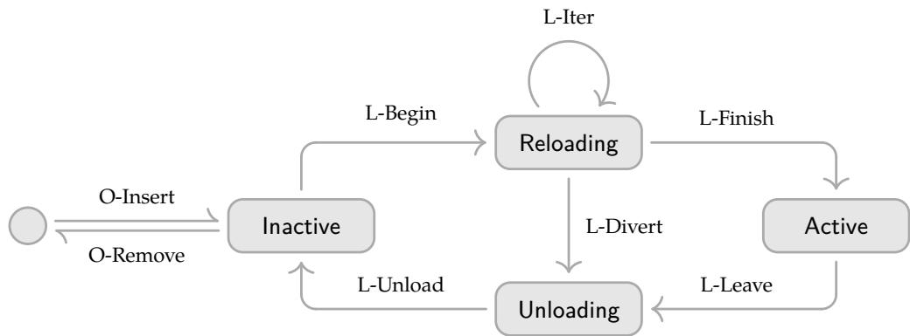

A map respecting $\simeq _ { S }$ is one that descends to $\Gamma / \simeq _ { S } ,$ , and two maps related by $\simeq _ { S }$ are two that descend to the same map there, each respecting it by Lemma 35. Reflexivity is the one property the function former does not preserve: $f \simeq _ { S } f$ demands related outputs at every pair of related inputs and not at the equal ones alone, so it holds of a map exactly where the map descends, which is why respect is a condition rather than a given. Respect at two key sets is two conditions of which neither implies the other, since ${ \simeq } \subseteq \simeq { _ { S } }$ weakens the hypothesis and the conclusion together. A map that branches on a key outside S is the case that separates them, respecting ≈ and failing to respect $\simeq _ { S }$

Definition 36. Define the effect function witnessed up to $\simeq _ { S }$ as:

$$
\begin{array} { r l } & { \mathfrak { E } _ { \Gamma } ^ { S } : = ( e : \Gamma  \Gamma \times ( \Gamma  \Gamma ) ) \times ( e \simeq _ { S } e ) } \\ & { \quad \quad \times ( ( \gamma : \Gamma )  ( \delta : \Gamma )  ( g : \Gamma  \Gamma )  ( ( \delta , g ) = e ( \gamma )  g ( \delta ) \simeq _ { S } \gamma ) ) } \end{array}\tag{36}
$$

The clause e $\simeq _ { S }$ e carries every constituent's respect, its instance at $\gamma \simeq _ { S } \gamma$ relating each yielded inverse to itself. We write ${ \mathfrak { E } } _ { \Gamma } ^ { * }$ for $\mathfrak { E } _ { \Gamma } ^ { K }$ , and taking ≈ to be equality on Γ recovers Definition $8 ,$ every map being equal to itself. The key set is where a component's declarations enter: what Section 4 holds an effect function to is $\dot { \mathfrak { E } _ { \Gamma } ^ { S } }$ at the keys that component names (Definition 48).

The iterator of Section 3.1.3 is witnessed the same way, its continuation compared by Definition 34 and witnessed again by the recursion:

Definition 37. Define the effect iterator witnessed up $t o \simeq _ { S }$ as:

$$
\begin{array} { r l } & { \mathfrak { I } _ { \Gamma } ^ { S } : = \mu \mathfrak { I } . ( e : \Gamma  \Gamma \times ( \Gamma  \Gamma ) \times \mathsf { M a y b e } ( \mathfrak { I } ) ) \times ( e \simeq _ { S } e ) } \\ & { \qquad \times ( ( \gamma : \Gamma )  ( \delta : \Gamma )  ( g : \Gamma  \Gamma )  ( o : \mathsf { M a y b e } ( \mathfrak { I } ) )  ( ( \delta , g , o ) = e ( \gamma )  g ( \delta ) \simeq _ { S } \gamma ) ) } \end{array}\tag{37}
$$

The embedding of Section 3.1.3 carries $\mathfrak { E } _ { \Gamma } ^ { S }$ into $\Im _ { \Gamma } ^ { S }$ , and taking ≈ to be equality on Γ and $S = K$ recovers the witnessed $\Im _ { \Gamma } ^ { * }$ of Definition 17.

Lemma 38. With ${ \mathfrak { E } } _ { \Gamma } ^ { * }$ read as in Definition $^ { 3 6 , }$ every equality of states asserted in Section 3.1 holds with = replaced by $\simeq ,$ and the accumulator of every state reachable from $( \gamma _ { 0 } , \mathrm { i d _ { \Gamma } } )$ respects $\simeq$ The same holds of any equivalence substituted for $\simeq ,$ the proof using no property of the relation beyond transitivity and respect.

Proof. An accumulator is a composition of inverses, each respecting $\simeq ,$ the clause $e \simeq e$ of Definition 36 read at $\gamma \simeq \gamma ,$ and a composition of maps respecting ≈ respects $\simeq ,$ the base case being $\mathrm { i d } _ { \Gamma }$ . The proofs of Section 3.1 then go through unchanged, respect being what carries a relation through an inverse: from $g _ { 2 } ( \delta _ { 2 } ) \simeq \delta _ { 1 }$ and $g _ { 1 } ( \delta _ { 1 } ) \simeq \gamma$ respect gives $( g _ { 1 } \circ g _ { 2 } ) ( \delta _ { 2 } ) \simeq \gamma ,$ which is the step each composition of inverses takes, and the soundness invariant of Theorem 7 reads $\varphi ( \gamma ) \simeq \gamma _ { 0 }$ by that step. □

The stage shape of Definition 30 settles which readings of $\simeq \ a$ member admits, and with them its membership in the witnessed iterators, which is what lets a claim about one component be read at the keys that component names.

Lemma 39. Let $i \in \Im _ { \Sigma } ^ { \mathcal { A } } ( S ^ { \prime } , P )$ and let $S \subseteq K$ contain every key at which a stage of i occurs. Then i lies in $\Im _ { \Sigma } ^ { S }$ (Definition 37); in particular i and every inverse it yields respect $\simeq _ { S } .$ , and the witnesses hold at equality.

Proof. By induction on the construction of Definition 30. The unit yields its argument, $\mathrm { i d } _ { \Sigma } .$ and Nothing everywhere. At an operation stage performing $a \in { \mathcal { A } } _ { k } ,$ let $\sigma \simeq _ { S } \sigma ^ { \prime } ;$ then $k \in S ,$ SO $\sigma ( k ) \simeq _ { k } \sigma ^ { \prime } ( k )$ . a respects $\simeq _ { k }$ (Lemma 32), so it is defined at both or at neither and yields $\simeq _ { k ^ { - } }$ related values, equal outcomes, and inverses carrying $\simeq _ { k }$ -related values to $\simeq _ { k }$ -related values, and its lift reads and writes k alone; the states reached are therefore $\simeq _ { S } \mathrm { - r e l a t e d }$ , the inverses are $\simeq _ { S }$ -related and respect $\simeq _ { S } ,$ and the equal outcomes select one continuation, to which the induction hypothesis applies. At a provision stage at $k \in P \subseteq S ,$ the precondition k $\notin$ dom(σ) holds at both or at neither, the states reached bind k to the one value the stage carries, and the restriction it yields respects $\simeq _ { S } ,$ two related states binding k alike. The witness of each stage holds at equality, the lift of an operation's inverse restoring the value Definition 29 witnesses it to and the restriction reverting the extension (Definition 20), and equality gives $\simeq _ { S }$ □

A stage reads the key it performs at and nothing else, so the hypothesis is met by taking S to be the keys the member names.

## 3.4. Attaining Independence

On the strength of Section 3.3, this section supplies the condition that extends the local guarantees to a system of interleaved components. Section 3.4.1 defines the condition, namely independence of two effect functions: every transformation of one commutes with every transformation of the other, forward maps and yielded inverses alike. Section 3.4.2 then reduces independence of context-mediated effect functions to commutativity at single coeffects and refines the coeffect with a witness of that commutativity, parallel to the witness of an effect function.

## 3.4.1. Effect Independence

Reverting an effect at the state its own application produced is what Theorem 16 covers; reverting one at any other state is what this subsection covers. Two situations call for the latter. An inverse may be run while later effects are still in place, which is what removing one component from a running system amounts to; and one sequence may interleave the effects of several components, each holding the inverses of its own, so that the inverses of one component are separated by the applications of another. In both an inverse meets a state that foreign effects have moved, and whether it still reverts what it was built to revert is a question of commutation: what has to commute is every transformation one effect can perform with every transformation the other can perform, forward map and yielded inverse alike. A single accumulator settles neither situation, $\varphi$ being a composite that runs every inverse it holds in one order and all at once.

An iterator gives rise to several maps: the forward map of each iteration it can reach, and the inverse each yields at each context state. Commutation of two iterators relates the two collections rather than two single maps, and those collections are what the definitions below quantify over.

Definition 40. For an iterator $i \in \Im _ { \Gamma } .$ , let reach(i) be the least set of iterators containing i and closed under continuation. The transformation monoid m(i) is the submonoid of $\Gamma  \Gamma$ generated by the forward maps and the yielded inverses of every iterator in reach(i), and the generators of (i) are the elements of that generating set:

$$
\begin{array} { r l } & { \mathrm { r e a c h } ( i ) : = \bigcap \{ S \mid i \in S \land \forall i ^ { \prime } \in S , \gamma \in \Gamma . i ^ { \prime } ( \gamma ) = ( - , - , \mathsf { J u s t } ( i ^ { \prime \prime } ) ) \Rightarrow i ^ { \prime \prime } \in S \} } \\ & { \quad \mathfrak { M } ( i ) : = \langle \{ \mathrm { p r } _ { 1 } \circ i ^ { \prime } \mid i ^ { \prime } \in \mathrm { r e a c h } ( i ) \} \cup \{ \mathrm { p r } _ { 2 } ( i ^ { \prime } ( \gamma ) ) \mid i ^ { \prime } \in \mathrm { r e a c h } ( i ) , \gamma \in \Gamma \} \rangle } \end{array}\tag{38}
$$

Write len(i) for the supremum of |C| over the chains $C \subseteq \mathrm { r e a c h } ( i )$ that continuation orders. Through the embedding of Section 3.1.3, m(e) at an effect function e is generated by the forward map of e together with every inverse e yields; an effect induced by a pair $( f , g ) \in \mathfrak { T } _ { \Gamma }$ has $f$ and $g$ for its generators, the inverse it yields being g at every state.

Lemma 41. Commutation is settled on the generators, and  enlarges no transformation monoid. That is,

1. if every generator of $\mathfrak { M } ( e _ { 1 } )$ commutes with every generator of $\mathfrak { M } ( e _ { 2 } )$ , then every element of $\mathfrak { M } ( e _ { 1 } )$ commutes with every element of ${ \mathfrak { M } } ( e _ { 2 } ) ;$

2. $\mathfrak { M } ( e _ { 1 } \circ e _ { 2 } ) \subseteq \langle \mathfrak { M } ( e _ { 1 } ) \cup \mathfrak { M } ( e _ { 2 } ) \rangle$

Proof.

1. The maps commuting with every generator of $\mathfrak { M } ( e _ { 2 } )$ form a submonoid of $\Gamma  \Gamma ,$ since $\mathrm { i d _ { T } }$ lies in it and $f \circ f ^ { \prime }$ does where $f$ and $f ^ { \prime }$ do. That submonoid contains the generators of $\mathfrak { M } ( e _ { 1 } )$ by hypothesis and hence contains $\mathfrak { M } ( e _ { 1 } )$ . Fixing $f \in \Re ( e _ { 1 } )$ , the maps commuting with f likewise form a submonoid containing the generators of $\mathfrak { M } ( e _ { 2 } )$ and hence $\mathfrak { M } ( e _ { 2 } )$

2. By Definition 9 the forward map of $e _ { 1 } \diamond e _ { 2 } \mathrm { i } s \left( \mathrm { p r } _ { 1 } \circ e _ { 1 } \right) \circ \left( \mathrm { p r } _ { 1 } \circ e _ { 2 } \right)$ and the inverse it yields at any state is $s \circ t$ for an s yielded by $e _ { 2 }$ and a t yielded by $e _ { 1 }$ . Every generator of ${ \mathfrak { M } } ( e _ { 1 } \circ$ $e _ { 2 } )$ is therefore a composite of generators of the two. □

Definition 42. Iterators $i , j \in \Im _ { \Gamma }$ are independent when

1. every transformation of one commutes with every transformation of the other,

$$
\forall f \in { \mathfrak { M } } ( i ) , g \in { \mathfrak { M } } ( j ) . \quad f \circ g = g \circ f\tag{39}
$$

2. neither one's transformations disturb what the other yields, inverse and continuation alike,

$$
\forall i ^ { \prime } \in \mathrm { r e a c h } ( i ) , g \in \mathfrak { M } ( j ) , \gamma \in \Gamma . \quad \mathrm { p r } _ { 2 , 3 } ( i ^ { \prime } ( g ( \gamma ) ) ) = \mathrm { p r } _ { 2 , 3 } ( i ^ { \prime } ( \gamma ) )\tag{40}
$$

and the same with i and $j$ exchanged.

A family ${ ( i _ { l } ) } _ { l \in L }$ is pairwise independent when $i _ { l }$ and $i _ { l ^ { \prime } }$ are independent for every ${ \mathit { l } } \neq { \mathit { l } } ^ { \prime } . \mathrm { A }$ family may repeat an iterator, and holding one independent of itself is holding M(i) commutative.

Read at effect functions through the embedding of Section 3.1.3, clause (2) compares the inverse alone, the continuation being Nothing at every state, and the result below is given at effect functions; Section 4 applies the definition at the iterators themselves. For effects induced by pairs $( f _ { 1 } , g _ { 1 } )$ and $( f _ { 2 } , g _ { 2 } )$ , clause (1) is by Lemma 41(1) the commutation of the four pairs $f _ { 1 } , f _ { 2 } ; g _ { 1 } , g _ { 2 } ; f _ { 1 } , g _ { 2 } ;$ and $g _ { 1 } , f _ { 2 } ,$ and clause (2) holds outright, an induced effect yielding one inverse at every state. Commutation under  is a different property. What $e _ { 1 } \diamond e _ { 2 } = e _ { 2 } \diamond e _ { 1 }$ equates is the composite forward map of the two orders with each other and the composite inverse of the two orders with each other, each inverse entering the composite at the state its own application produced; independence instead relates each transformation of one effect to each transformation of the other, a forward map paired with a foreign inverse included.

Under independence an inverse may be run at a state later effects have moved, and it withdraws there its own contribution and nothing else, whatever order the inverses are applied in:

Theorem 43. Let $e _ { 1 } , \cdots , e _ { n } \in \mathfrak { E } _ { \Gamma } ^ { * }$ be pairwise independent and applied in order from $\gamma _ { 0 } ,$ and let each $g _ { i }$ be the inverse $e _ { i }$ yields where it is applied. Applying the n inverses at the state the sequence reaches, in the order of any permutation of $\{ 1 , \cdots , n \}$ , reaches $\gamma _ { 0 }$

Proof. Write $f _ { i } : = \mathrm { p r } _ { 1 } \circ e _ { i } ,$ let $\delta _ { i } : = f _ { i } ( \delta _ { i - 1 } )$ with $\delta _ { 0 } : = \gamma _ { 0 } ,$ so that $g _ { i } = \mathrm { p r } _ { 2 } ( e _ { i } ( \delta _ { i - 1 } ) )$ . Fix j and write $\delta _ { i } ^ { \prime } : = \big ( f _ { i } \circ \cdots \circ f _ { j + 1 } \big ) \big ( \delta _ { j - 1 } \big )$ for the states of the sequence with $e _ { j }$ omitted, so that $\delta _ { j } ^ { \prime } = \delta _ { j - 1 }$ Two claims hold for every u with $j \le u \le n$

$( 1 ) \delta _ { u } = f _ { j } ( \delta _ { u } ^ { \prime } )$ and $g _ { j } ( \delta _ { u } ) = \delta _ { u } ^ { \prime }$ . The first equation is an induction on u: at $u = j$ it reads $\delta _ { j } = f _ { j } ( \delta _ { j - 1 } )$ , which is the definition of $\delta _ { j } ,$ and for the inductive step, $\delta _ { u + 1 } = f _ { u + 1 } ( \delta _ { u } ) =$ $\begin{array} { r } { \dot { f } _ { u + 1 } \big ( \dot { f } _ { j } ( \dot { \delta } _ { u } ^ { \prime } ) \big ) = f _ { j } \big ( f _ { u + 1 } ( \delta _ { u } ^ { \prime } ) \big ) = f _ { j } \big ( \delta _ { u + 1 } ^ { \prime } \big ) } \end{array}$ , the middle equality being clause (1) of Definition 42 for $e _ { u + 1 }$ and $e _ { j } ,$ which are distinct effects of the family since $u + 1 > j$ For the second equation, clause (1) carries $g _ { j }$ out through the forward maps applied after $e _ { j } ,$ leaving the witness of $e _ { j }$ to be used at the one state it holds at:

$$
g _ { j } ( \delta _ { u } ) = \bigl ( g _ { j } \circ f _ { u } \circ \cdots \circ f _ { j + 1 } \bigr ) \bigl ( \delta _ { j } \bigr ) = \bigl ( f _ { u } \circ \cdots \circ f _ { j + 1 } \bigr ) \bigl ( g _ { j } \bigl ( f _ { j } \bigl ( \delta _ { j - 1 } \bigr ) \bigr ) \bigr ) = \delta _ { u } ^ { \prime }
$$

the last equality resting on $g _ { j } \big ( f _ { j } \big ( \delta _ { j - 1 } \big ) \big ) = \delta _ { j - 1 } ,$ , which is the witness Definition 8 requires of $e _ { j }$ at $\delta _ { j - 1 }$

(2) Each $e _ { i }$ with $i > j$ yields at $\delta _ { i - 1 } ^ { \prime }$ the same inverse $g _ { i }$ it yields at $\delta _ { i - 1 }$ : by (1) the state $\delta _ { i - 1 }$ is $f _ { j } ( \delta _ { i - 1 } ^ { \prime } )$ , and $f _ { j } \in \mathfrak { M } ( e _ { j } )$ , so clause (2) of Definition 42 for $e _ { i }$ and $e _ { j } \mathrm { g i v e s } \mathrm { p r } _ { 2 } \big ( e _ { i } \big ( f _ { j } ( \delta _ { i - 1 } ^ { \prime } ) \big ) \big ) =$ $\mathrm { p \bar { r } _ { 2 } } ( e _ { i } ( \delta _ { i - 1 } ^ { \prime } ) )$

The theorem follows by downward induction on n. Let the permutation begin with j. By (1) applying $g _ { j }$ at $\delta _ { n }$ reaches $\delta _ { n } ^ { \prime } .$ , the state the sequence with $e _ { j }$ omitted reaches, and by (2) the inverses the remaining effects yielded there are the $g _ { i }$ in hand. That sequence is pairwise independent, being a subfamily, so the induction hypothesis applies to it and to the rest of the permutation; the empty sequence reaches $\gamma _ { 0 }$ □

Section 4.3.2 carries this conclusion to a trace of a whole system, where the steps of other fibers intervene between an effect and its revert.

## 3.4.2. Coeffect Commutativity

The commutation Definition 42 requires is read up to ≈ by Lemma 38, a yielded continuation compared as Definition 34 compares two iterators, and reading it that way is what makes it attainable at all: two operations may leave values that $\simeq _ { k }$ identifies and still count as commuting. Of two operations it requires one thing more than of the effect functions their lifts induce, an operation yielding an outcome as well.

Definition 44. Operations a and $a ^ { \prime }$ are independent when their lifts are independent as effect functions (Definition 42) at every pair of arguments, and neither one's transformations disturb the outcome the other yields:

$$
\forall x : X _ { a } , g \in \mathfrak { M } ( a ^ { \prime \Sigma } ) , \sigma \in \Sigma . \quad \operatorname { p r } _ { 3 } \big ( a ^ { \Sigma } ( x ) ( g ( \sigma ) ) \big ) = \operatorname { p r } _ { 3 } \big ( a ^ { \Sigma } ( x ) ( \sigma ) \big )\tag{41}
$$

and the same with a and $a ^ { \prime }$ exchanged, writing ${ \mathfrak { M } } ( a ^ { \Sigma } )$ for the submonoid generated by the forward maps and yielded inverses of the lifts $a ^ { \Sigma } ( \dot { x } )$ over every argument, as Definition 40 generates M. A key k is commutative when any two operations of $\boldsymbol { A } _ { k }$ are independent, an operation being held independent of itself as well.

Across distinct keys the condition holds outright.

Theorem 45. Operations at distinct keys are independent.

Proof. Let a lie in $\mathcal { A } _ { k }$ and $a ^ { \prime }$ in $\boldsymbol { A } _ { k ^ { \prime } }$ with k $\neq k ^ { \prime }$ . By Definition 29 every generator of ${ \mathfrak { M } } ( a ^ { \Sigma } )$ is of the form $\sigma \mapsto \sigma [ k \mapsto u ( \sigma ( k ) ) ]$ for a map u on $\nu _ { k } ,$ , being either the lift of a forward map or the lift of a yielded inverse, and likewise for $a ^ { \prime }$ at $k ^ { \prime }$ . Two such maps commute, each reading and writing one key alone and the two keys differing, and Lemma 41 (1) extends the commutation from the generators to the two monoids. For the second condition, what $a ^ { \Sigma }$ yields at $\sigma ,$ inverse and outcome alike, is determined by $\sigma ( k )$ , which every generator of m $\left( a ^ { \prime \Sigma } \right)$ leaves as it stands.

The condition therefore turns on the pairs at one key, and the proof of their independence is made a constituent of the coeffect itself, as the proof that an inverse reverts is a constituent of the effect function (Definition 8):

Definition 46. A coeffect at k (Definition 29) is witnessed when it carries, as a third constituent beside $\nu _ { k }$ and $\boldsymbol { A } _ { k } ,$ a proof that k is commutative (Definition 44).

The two witnesses are parallel: each certifies the condition its consumers would otherwise have to assume, the returned inverse reverting there and the operations commuting here, and each is supplied where the definition is written rather than checked where it is used. By Theorem 45 the proof concerns the operations of k alone, so the obligation falls on the component providing the key and on no component consuming it; the examples below are how it is discharged. From here on every coeffect is witnessed, and Section 4 reads every key of K so.

A key whose value is a table of entries is commutative when each registration takes an entry of its own, registration of a route or of an event listener being the representative case. The operation draws an identifier for the entry it adds and the inverse it yields removes that entry, so two registrations name two entries whatever they register: either order leaves a table that answers every test alike, and either registration can be withdrawn while the other stands. Replicated data types are designed to this condition and attach a unique tag to each addition for this very reason, a set whose additions and removals name a bare element having no such property [43]. A key whose value is an ordered chain is not commutative, since a middleware inserted before another sees a different request, and neither order can be withdrawn without disturbing the other.

The allocator of the opening example divides by what its interface publishes. Where the handles it hands out are compared by no operation of the key, no test observes them, ${ \bf s o } \simeq _ { k }$ relates two heaps up to a renaming of handles and allocation is commutative; a renaming is an equivalence the operations respect, contained in $\simeq _ { k }$ by Lemma 32(2), and it is how CompCert relates the memory states of a program and of its translation [44]. Where the addresses are outcomes compared by equality, the outcome of a further allocation separates the two orders of allocation, and the key is not commutative. POSIX draws the same line across its own allocators: mmap may return any unused address and creat may assign any unused inode, whereas open is required to return the lowest available descriptor, and that requirement alone is what stops two descriptor allocations from commuting [45].

Definition 31 turns each of these divisions into a design choice. $\simeq _ { k }$ is indistinguishability under the tests the operations of k generate, so an interface publishing fewer outcomes admits fewer tests and coarsens the relation, and withholding an outcome its callers do not need can carry a key from one side of a division to the other. The scalable commutativity rule applies the same move across the POSIX interface, and reads commutativity as indistinguishability through an interface rather than equality of internal states [45].

Independence of two context-mediated iterators (Definition 30) turns on their keys alone:

Theorem 47. Let $i _ { 1 } \in \Im _ { \Sigma } ^ { A } ( S _ { 1 } , P _ { 1 } )$ and $i _ { 2 } \in \Im _ { \Sigma } ^ { A } ( S _ { 2 } , P _ { 2 } )$ with $P _ { 1 } \cap S _ { 2 } = P _ { 2 } \cap S _ { 1 } = \emptyset$ , and let every key at which operations of both occur be commutative (Definition 44). Then $i _ { 1 }$ and $i _ { 2 }$ are independent (Definition 42).

Proof. Every iterator reach $( i _ { l } )$ contains is the unit or a stage, whose forward map and yielded inverses are the constituents of the operation or the set its head performs, so the generators of $\mathfrak { M } ( i _ { l } )$ are among those of the stages occurring in $i _ { l } ,$ together with $\mathrm { i d } _ { \Sigma }$

For clause (1) of Definition 42 it is enough, by Lemma 41(1), that those generators commute pairwise. Each is key-local: defined by the binding at one key alone, presence included, and writing that binding alone, being the lift of an operation's forward map or of an inverse it yields (Definition 29), the extension a provision stage takes, or the restriction it yields (Definition 20). Two key-local maps at distinct keys commute, each leaving what the other reads and writes as it stands. This settles every pair involving a provision-stage generator, whose key lies in one $P _ { l }$ and hence outside the other member's every key by hypothesis, and every pair of operation generators at distinct keys, which is Theorem 45; a pair of operation generators at one key is covered by that key's commutativity.

For clause (2), take $i ^ { \prime } \in \mathrm { r e a c h } ( i _ { 1 } ) , g \in \mathfrak { M } ( i _ { 2 } )$ , and $\sigma \in \Sigma$ . The unit yields $( \mathrm { i d } _ { \Sigma }$ , Nothing) everywhere. A provision stage at $k \in P _ { 1 }$ yields the restriction at k and its one continuation whatever the state, and is defined at $\sigma$ and $g ( \sigma )$ alike, its precondition reading the presence of $k ,$ which every generator of $\mathfrak { M } ( i _ { 2 } )$ leaves as it stands. An operation stage at $k \in S _ { 1 }$ yields what $a ^ { \Sigma } ( x )$ yields at $\sigma ( k )$ , inverse and outcome; where no operation of $i _ { 2 }$ occurs at k the generators of $\mathfrak { M } ( i _ { 2 } )$ leave $\sigma ( k )$ as it stands, and where one does the key is commutative by hypothesis, and independence of its operations, applied to one generator of $g$ at a time, yields the same inverse and the same outcome at $g ( \sigma )$ . Equal outcomes select one continuation, so the yields agree.

With every coeffect witnessed, the commutativity hypothesis of Theorem 47 is supplied at every key (Definition 46), and only the disjointness $P _ { 1 } \cap S _ { 2 } = P _ { 2 } \cap S _ { 1 } = \emptyset$ remains to be checked of a pair; Section 4 reads that disjointness off the two components' declarations.

A component's effect function is the lift of a context-mediated iterator along the coeffect projection (Definition 56), and independence transfers to that lift, whose transformations move the projection alone. The assumption Section 3.4.1 leaves open is met that way, the witness of each coeffect supplying the commutativity Theorem $4 7$ consumes, and with it the temporal composability of a whole system of components.

What the decomposition divides is a computation's commuting part from its order-sensitive part. The commuting part is carried by the effects: a component performs them in whatever order its task calls for, and Theorem 43 reverts them in whatever order the system finds convenient, no two components constraining each other. The order-sensitive part is carried by the coeffects, since a key whose operations do not commute is one whose order has to be imposed from outside the effects, and two places are available for imposing it. Within one component the accumulator imposes it, reverting in LIFO order whatever the effects (Theorem 16). Across components a declared coeffect imposes ${ \mathrm { i t } } ,$ one component providing what another declares and the provision preceding the declaration's satisfaction (Section 3.2.2). Composability is thereby had at the grain of components rather than of single effects, which is the scale Section 4 works at.

One limit of the theorem is worth naming, and it is the hypothesis this section opened on: binding every shared location at a key is the paradigm's discipline and not a property of the construction, so a location the system cannot reify as a coeffect lies outside the boundary of Section 6.1 and outside the theorem with it.

## 4. A Calculus of Dynamic Composition

This section gives the theory of Section 3 an operational semantics. It decomposes a running system into components, each a triple of a coeffect specification, a provision, and a witnessed effect function. The instantiations of components are fbers, and the calculus supplies the rules that move them: orchestration rules, by which the orchestrator inserts and retires fibers, and lifecycle rules, by which the system activates and deactivates them unprompted. The metatheory then establishes temporal and spatial composability in their global form, the guarantees Section 3 reads of one component holding of every fiber of an arbitrary interleaving.

## 4.1. Components and Fibers

This section fixes the objects the rules act on: the component; the fiber, an instantiation of a component carrying a lifecycle state of its own; and the registry, which holds the fibers a state carries and from which the coeffect context is read off.

Components. A component is given as a triple, its coeffect side split into what it reads from the environment and what it provides to it.

Definition 48. A component over a context Γ carrying both effects and coeffects (Definition 28) is defined as:

$$
{ \mathfrak { E } } _ { \Gamma } : = ( d : { \mathfrak { D } } _ { \Gamma } ) \times ( p : \mathfrak { P } _ { \Gamma } ) \times { \mathfrak { I } } _ { \Gamma } ^ { d \cup p }\tag{42}
$$

representing a triple $( d , p , e )$ , where:

$d : { \mathfrak { D } } _ { \Gamma }$ is the coeffect specification of Definition 21, declaring the dependencies required from the environment;

$p : \mathfrak { P } _ { \Gamma } : = \mathsf { S e t } ( K )$ is the coeffect provision, declaring the coeffect keys the component may provide, and no key outside p is one its effect function installs a binding at;

${ \overline { { e } } } : { \mathfrak { I } } _ { \Gamma } ^ { d \cup p }$ is the witnessed effect function, an effect iterator (Definition 17) witnessed up to $\simeq _ { d \cup p }$ (Definition 37), defining the effects contributed when the component is active together with the inverses that withdraw them; a plain effect function enters through the embedding of Section 3.1.3.

Subscripts are taken on Γ throughout, the coeffect context being one of its projections (Definition 28), so the $\mathfrak { D } _ { \Sigma }$ of Definition 21 is written ${ \mathfrak { D } } _ { \Gamma }$ here.

Fibers. One component may be instantiated many times over, and each instantiation is activated and deactivated over time, carrying a lifecycle state of its own. We name such an instantiation a fiber. A fiber records the component that produced it, the fiber it was instantiated under, the coeffects it provides, and where in its lifecycle it stands.

Definition 49. Fix a set X of fiber names. A fiber instantiating the component $( d , p , e ) \in \mathfrak { C } _ { \Gamma }$ is a tuple $\langle d , p , e , \pi , \sigma , \tau , \theta \rangle$ , where

$d : \mathfrak { D } _ { \Gamma } , p : \mathfrak { P } _ { \Gamma } ,$ , and $e : \Im _ { \Gamma } ^ { d \cup p }$ are the coeffect specification, provision, and effect function of Definition 48;

• π : N ∪ {root} is the parent, the fiber this one was instantiated under, or the root marker root;

$\sigma : \Sigma$ is the fiber's own coeffect table (Definition 19), empty until it activates and written by its effects as they run;

$\tau : \{ \bot , \top \}$ is the retirement flag, ⊥ in a fresh fiber and T once the orchestrator has retired the fiber;

$\theta : \Theta _ { \Gamma }$ is the lifecycle state:

$$
\Theta _ { \Gamma } : = | \mathsf { n a c t i v e } \mid \mathsf { R e l o a d i n g } ( i , g , \omega ) \mid \mathsf { A c t i v e } ( g , \omega ) \mid \mathsf { U n l o a d i n g } ( g , \omega )\tag{43}
$$

where $i : \Im _ { \Gamma } ^ { d \cup p }$ is the remaining effect iterator, $g : \Gamma \to \Gamma$ the accumulator built so far, and $\omega : d  \mathfrak { N }$ the committed view.

A fiber is installed when its lifecycle state carries an accumulator and a committed view:

$$
\mathrm { i n s t a l l e d } _ { n } ( \gamma ) : = \theta _ { n } \neq \mathsf { I n a c t i v e }\tag{44}
$$

and an installed fiber resolves k to m when $\omega _ { n } ( k ) = m$

A transition is what moves a fiber from one lifecycle state to another, and between transitions the fiber rests at one of the two settled states, Inactive or Active, contributing nothing at the first and its effects at the second. A transition runs in one of two directions: an activation executes $e ,$ accumulating side effects on the context, and a deactivation applies the accumulator to recover the context. A transition in a real runtime is spread over an interval rather than taken in one step, so each direction has a state of its own that the fiber occupies while the transition runs, Reloading for an activation and Unloading for a deactivation. The committed view ω sends each key the fiber declares to the name of the fiber that provided it when the transition committed. Section 4.2 draws the four states as a state machine (Figure 1) and supplies the rules on its edges.

Registry. A state holds its fibers under their names, and both the identity of a fiber and the coeffect context of Section 3.2 are read off that arrangement.

Definition 50. Write $\mathfrak { F } _ { \Gamma }$ for the set of fibers over Γ. A state $\gamma \in \Gamma$ carries a registry

$$
F _ { \gamma } : \mathfrak { N } \to \mathfrak { F } _ { \Gamma }\tag{45}
$$

a finite partial function whose parent pointers form a tree rooted at root, together with whatever else in Γ no fiber's σ names. We write $\gamma ( n )$ for $F _ { \gamma } ( n )$ , and abbreviate a field of $\gamma ( n )$ by subscripting it with n where the state is clear, so that $d _ { n } , p _ { n } , e _ { n } , \pi _ { n } , \sigma _ { n } , \tau _ { n } , \theta _ { n }$ are the fields of Definition 49 and $g _ { n } , \omega _ { n }$ the accumulator and committed view that $\theta _ { n }$ carries; $r [ \theta _ { n } \mapsto \theta ^ { \prime } ]$ , γ[n → $\langle \cdots \rangle ]$ , and $\gamma \setminus n$ are the states differing from $\gamma$ in one field, one fiber, and the presence of one fiber respectively.

A fiber's name is what gives it an identity that survives its own mutation: every rule below rewrites the lifecycle state of one fiber and leaves the others alone, so the rule has to say which one, and two fields refer to fibers rather than describe them, the parent π and the committed view ω. Names are atoms: no rule computes one, inspects its structure, or relates two of them by anything but equality, and introducing a fiber simply draws one not already in use. This is the discipline of dynamically created local names [40], used here for fiber identity.

Each fiber owning a table means the coeffect context is derived rather than stored: it is what the active fibers jointly provide.

$$
\sigma _ { \gamma } : = \bigcup \{ \sigma _ { m } ~ | ~ m \in \mathrm { d o m } ( F _ { \gamma } ) , \theta _ { m } = \mathsf { A c t i v e } ( - , - ) \}\tag{46}
$$

The union is well defined because a fiber's own table holds only the keys of its provision, dom $( \sigma _ { n } ) \subseteq p _ { n }$ (Definition 48), and the provisions of distinct fibers are disjoint, O-Insert admitting no fiber whose provision meets an existing one (Section 4.2.1), so each $k \in \mathrm { d o m } ( \sigma _ { \gamma } )$ lies in the table of exactly one Active fiber, whose name we write provider $_ k ( \gamma ) \in \mathfrak { N }$ and call the provider of k. Each key therefore has one possible provider, fixed by the provisions and not by the state. No rule writes a table directly: the bindings a fiber provides are the provision stages its own effect function performs, which land in $\sigma _ { n }$ and so are already part of the state $e _ { n }$ returns, and they leave again with the accumulator, and the operations it performs at a declared key act on the value its provider's table holds (Definition 56). An effect function is built from such stages and from nothing else, so a location no key binds is one no fiber touches.

The disjointness the union rests on is where this chapter parts company with Section 3.2.3, and it simplifies the formalization rather than the systems it models. The isolation of Definition 24 lets one key resolve through a realm table, so that two fibers may provide the same key in different realms; a calculus carrying realms would relax disjointness to disjointness within a realm, resolving a declared key against the realm of the fiber declaring it (Section 4.4 supplies that reading). We read every key at one shared realm instead, and a system that wants several providers of one key keeps two routes: realms, and the broker of Section 6.2, one fiber providing the key and dispatching among implementations registered with it. Within the calculus, the disjointness restricts how often a component may be instantiated: one with a nonempty provision has one fiber at a time, so the many instantiations below are of components providing nothing, which is the common case of a component that only consumes, or that instantiates others.

With $\sigma _ { \gamma }$ in hand, the satisfaction relation of Section 3.2.2 applies unchanged, $\gamma \models$ d abbreviating $\sigma _ { \gamma } \models d . \mathrm { A }$ key lies in dom $\left( \sigma _ { \gamma } \right)$ exactly when some Active fiber has installed it, its provision being the keys it may install rather than the ones it has, so $\gamma ^ { \textsf { k } }$ d already requires that every declared key have an Active provider. Taking the union over Active fibers alone is what lets a fiber cease to provide before it has withdrawn anything, which Section 4.2.2 turns into the ordering discipline, and it fixes how a transition in progress reads: a Reloading or Unloading fiber reads its coeffects through the $\omega$ it holds and provides none of its own, so a key its transition has already written is not yet one a dependent may activate against.

The two declarations of Definition 48 are the two directions of one interface, d what a component reads from the environment and $p$ what it writes to it, and the superscript on the effect function's type holds the witness to that interface. A fiber holds its own bindings whether or not they are published, so the projection the witness is read at is a second reading of the same tables.

## Definition 51. Write

$$
\sigma _ { \gamma } ^ { S } : = \bigcup \{ \sigma _ { m } | _ { S } \ | \ m \in \mathrm { d o m } ( F _ { \gamma } ) \}\tag{47}
$$

for the bindings the registry records at a set $S \subseteq K$ of keys, over every fiber and not the Active ones alone; disjointness of provisions makes it a function, and $\sigma _ { \gamma }$ is the restriction of $\sigma _ { \gamma } ^ { K }$ to the Active fibers. This is the coeffect projection Definition 33 is read at throughout this section, so that $\gamma \simeq _ { S } \delta$ is $\sigma _ { \gamma } ^ { S } \simeq \sigma _ { \delta } ^ { S }$ and $\Im _ { \Gamma } ^ { S }$ (Definition 37) is the effect functions witnessed at those keys.

The keys of both declarations are read off the tables rather than off $\sigma _ { \gamma } ,$ and the witness condition is why: a binding a transition has written stays in the fiber's table before the fiber is Active, and that binding is what the inverse is held to remove, so the projection the witness is read at has to hold it wherever the fiber's lifecycle stands. The same reading keeps the relation where the control fields cannot move it: a write to a lifecycle state can move a table into or out of $\sigma _ { \gamma }$ with every binding left as it stands, whereas $\sigma _ { \gamma } ^ { S }$ moves only where some binding does. What the witness is thereby held to restore is the two declarations and nothing else.

## 4.2. The Calculus

This section gives the calculus: nine rules generating two relations. An orchestration rule, prefixed O- and written $\gamma \Rightarrow \delta ,$ , is an action the orchestrator may perform; its premises say when the action is legal, not when it occurs. A lifecycle rule, prefixed L- and written $\gamma \longrightarrow \delta ,$ is a step the system takes unprompted whenever its premises hold. A sequence of steps interleaves the two. Eight of the nine lie on the edges of Figure 1; O-Retire writes the retirement flag alone and applies at every lifecycle state, so it would be a self-loop at each of the four nodes, and the figure omits it.

  
Figure 1  The component lifecycle, with the empty node marking a fiber absent from the registry

## 4.2.1. Orchestration

Insertion and retirement are the only external inputs: the orchestrator requests that a fiber exist or stop existing, and never sets its lifecycle state directly.

$$
\begin{array} { r l } { \frac { n \not \in \mathrm { d o m } \left( F _ { \gamma } \right) } { \gamma } } & { \pi \in \mathrm { d o m } \left( F _ { \gamma } \right) \cup \{ \mathrm { r o o t } \} \quad \left( d , p , e \right) \in \mathfrak { C } _ { \Gamma } \quad \forall m \in \mathrm { d o m } \left( F _ { \gamma } \right) . p \cap p _ { m } = \emptyset \quad \mathrm { O . h s e r t } } \\ & { \qquad \gamma \Rightarrow \gamma [ n \mapsto \langle d , p , e , \pi , \otimes , \bot , \mathrm { l n a c t i v e } \rangle ] } \\ & { \qquad \frac { n \in \mathrm { d o m } \left( F _ { \gamma } \right) } { \gamma \Rightarrow \gamma [ \tau _ { n } \mapsto \top ] } \mathrm { O . R e t i r e } } \\ & { \qquad \frac { \tau _ { n } = \top } { \gamma \Rightarrow \gamma \setminus \sigma _ { n } = \emptyset } \quad \forall m . \pi _ { m } \neq n } \\ & { \qquad \gamma \Rightarrow \gamma \setminus n } \end{array}
$$

O-Retire is unconditional on the fiber's state because retiring is a request, and the lifecycle rules are what carry it out. Retirement is separated from removal for the same reason: a retired fiber that is still Active must first be deactivated, and removing it earlier would discard the accumulator and leak. The premise ∀m. $\pi _ { m } \neq n$ keeps the tree well-formed by removing children before their parent, and $\sigma _ { n } = \emptyset$ admits only an entry holding no bindings, so that a removal discards none: a deactivation leaves the entry so (Corollary 69), and it is what lets Theorem 68 count a removal as no change to the tables. The last premise of O-Insert is where the single-source discipline is imposed: a key has one possible provider because the orchestrator may not admit a second component declaring it.

Instantiation. A component may instantiate another while installing its effects, which is what a plugin host does when a plugin loads plugins of its own. The rules so far leave the registry to the orchestration rules alone, so such an instantiation has nowhere to happen. One primitive gives it somewhere.

Definition 52. An iteration of $e _ { n }$ may instantiate a component $( d , p , e ) \in \mathfrak { C } _ { \Gamma }$ . In place of a state map it takes the O-Insert of that component with $\pi = n ,$ and it yields as its inverse the O-Retire of the fiber so instantiated. The rule draws the name, subject to the freshness premise of O-Insert, and hands it to the effect function.

The inverse retires rather than removes, and the reason is that an inverse has to apply wherever it is reached. O-Remove carries premises, so an inverse built from it can fail to: a parent whose child is still Active could not run its accumulator, and no rule would move the child, since Definition 53 does not read the fiber tree. O-Retire has $n \in \mathop { \mathrm { d o m } } \mathop { \left( F _ { \gamma } \right) }$ as its only premise. The entry it leaves behind at the state the instantiation was taken is retired, Inactive, and holds an empty table, which is the vestigial entry of Lemma 62: it differs from the absence of the fiber in control fields alone, and no rule tells the two apart.

Retiring a child sets τ and so takes its target view to ⊥, after which the ordinary rules carry it back to Inactive. The parent is not made to wait, O-Retire being unconditional, so L-Unload applies to the parent whether or not the child has left. A grandchild is reached one level at a time, the child's own accumulator retiring what the child instantiated. Theorem 73 covers this cascade and the one the guard of Section 4.2.2 imposes along coeffects together.

## 4.2.2. Lifecycle

The six lifecycle rules divide by the direction they move a fiber in: an activation carries a fiber toward a target view it does not yet hold, and a deactivation carries one away from a committed view that is no longer its target.

Target views. The rules compare each fiber against a target, namely whether it ought to be running and against which resolution of its dependencies. The target is not a property of the fiber alone, since the keys a fiber declares are resolved against the whole state, so it is a predicate on that state.

Definition 53. The target view of n at γ maps each declared key to its provider, so it is a total map $d _ { n } \to \mathfrak { N }$ , and is ⊥ when n ought not to be running at all:

$$
\mathrm { t a r g e t } _ { n } ( \gamma ) : = \left\{ \begin{array} { l l } { \hfill \perp } & { \mathrm { i f } \ \tau _ { n } \vee \neg ( \gamma \models d _ { n } ) } \\ { \hfill ( k \in d _ { n } ) \mapsto \mathrm { p r o v i d e r } _ { k } ( \gamma ) } & { \mathrm { o t h e r w i s e } } \end{array} \right.\tag{48}
$$

A state is quiescent when every fiber has settled at its target view, no transition left in progress:

$$
\operatorname { q u i e t } ( \gamma ) : = \forall n \in \operatorname { d o m } ( F _ { \gamma } ) . \left\{ { \begin{array} { l l } { \operatorname { t a r g e t } _ { n } ( \gamma ) = \bot } & { { \mathrm { i f ~ } } \theta _ { n } = { \mathsf { l n a c t i v e } } } \\ { \operatorname { t a r g e t } _ { n } ( \gamma ) = \omega _ { n } } & { { \mathrm { i f ~ } } \theta _ { n } = \mathsf { A c t i v e } ( - , \omega _ { n } ) } \\ { \bot } & { { \mathrm { o t h e r w i s e } } } \end{array} } \right.\tag{49}
$$

The target answers to two things and to nothing else: retirement, through $\tau _ { n } ,$ and coeffect resolution, through $\gamma \models d _ { n }$ and providerk, each declared key being read off $\sigma _ { \gamma }$ at the one shared realm of Section 4.1.

The committed view of Definition 49 has the same type as the target view, and the lifecycle is driven by comparing them: $\omega _ { n }$ is the resolution n activated against, $\mathrm { t a r g e t } _ { n } ( \gamma )$ the one it should be running against, and every rule below fires on their agreeing or differing. This is the reactive discipline of Section 3.2: a transition is initiated whenever the target view changes, regardless of which of the two moved it. Recording a provider rather than a value is what makes the comparison usable, since a different fiber providing an equal value would otherwise compare equal. The value a component reads is reached through the view, since the provider's table holds that value, and the implementation holds the map in fiber. committed and a hash of it in fiber.target (Section 5.1.3).

Activation. An activation may execute multiple effects in sequence, and the deactivation must revert them. The effect iterator $e _ { n }$ models such an activation (Section 3.1.3), each of its iterations yielding the modified context, an inverse, and a continuation, and a component's whole activation is one run of $e _ { n } \colon \mathrm { L } { \mathrm { - B e g i n } }$ enters Reloading, L-Iter takes one iteration, and L-Finish lands the last.

$$
\frac { \theta _ { n } = \mathsf { I n a c t i v e } \quad \omega = \mathrm { t a r g e t } _ { n } ( \gamma ) \neq \perp } { \gamma \longrightarrow \gamma [ \theta _ { n } \mapsto \mathsf { R e l o a d i n g } ( e _ { n } , \mathrm { i d } _ { \Gamma } , \omega ) ] } \ \mathrm { L } \mathrm { - B e g i n }
$$

$$
\frac { \theta _ { n } = \mathsf { R e l o a d i n g } ( i , g , \omega ) \quad \mathrm { t a r g e t } _ { n } ( \gamma ) = \omega \quad i ( \gamma ) = ( \delta , h , \mathsf { J u s t } ( i ^ { \prime } ) ) \quad \scriptstyle \mathrm { L - I t e r } } { \gamma \longrightarrow \delta [ \theta _ { n } \mapsto \mathsf { R e l o a d i n g } ( i ^ { \prime } , g \circ h , \omega ) ] } \quad \scriptstyle \mathrm { L - I t e r }
$$

$$
\frac { \theta _ { n } = \mathsf { R e l o a d i n g } ( i , g , \omega ) \quad \mathrm { t a r g e t } _ { n } ( \gamma ) = \omega \quad i ( \gamma ) = ( \delta , h , \mathsf { N o t h i n g } ) \quad \scriptstyle \mathrm { L - F i n i s h } } { \gamma \longrightarrow \delta [ \theta _ { n } \mapsto \mathsf { A c t i v e } ( g \circ h , \omega ) ] } \quad \scriptstyle \mathrm { L - F i n i s h }
$$

Each iteration composes the newly yielded inverse onto the accumulator as ${ \mathit { g } } \circ h ,$ , following Definition 18, so that the accumulator applies the inverses in last-in-first-out order.

Deactivation. A deactivation enters from either stage of the lifecycle: L-Divert takes out a fiber whose transition is still in progress, and L-Leave one that is Active. It cannot be taken in one step. A component being torn down because its provider is going away is running its own teardown code, which may need the very coeffect that is being withdrawn; closing a connection pool typically means handing the connections back to whatever provided them. The consumer must therefore still be able to read the key throughout its own deactivation, and the provider's withdrawal must take effect only afterwards, which gives content to the ordering Section 3.2 requires of dependencies and dependents. A deactivation taken in one step would remove the provisions and run the inverse together, with no interval between them for a consumer's teardown to occupy. The rules below therefore separate the decision from the act, and the act is guarded by the following condition.

$$
\operatorname { r e l i e d } _ { n } ( \gamma ) : = \exists m \in \operatorname { d o m } \bigl ( F _ { \gamma } \bigr ) , k \in d _ { m } . m \neq n \land \operatorname { i n s t a l l e d } _ { m } ( \gamma ) \land \omega _ { m } ( k ) = n
$$

Definition 54. The fiber n is relied upon at γ when some other installed fiber resolves a key to it:

(50)

$$
\begin{array} { r l } & { \underbrace { \theta _ { n } = \mathsf { R e l o a d i n g } ( i , g , \omega ) \quad \mathrm { t a r g e t } _ { n } ( \gamma ) \neq \omega \quad ( \delta , h ) = ( \gamma , \mathrm { i d } _ { \Gamma } ) \vee i ( \gamma ) = ( \delta , h , - ) } _ { \displaystyle \gamma \longrightarrow \delta [ \theta _ { n } \mapsto \mathsf { U n l o a d i n g } ( g \circ h , \omega ) ] } \mathrm { L } \mathrm { \lrcorner D i v e r t } } \\ & { \qquad \underbrace { \theta _ { n } = \mathsf { A c t i v e } ( g , \omega ) \quad \mathrm { t a r g e t } _ { n } ( \gamma ) \neq \omega } _ { \displaystyle \gamma \longrightarrow \gamma [ \theta _ { n } \mapsto \mathsf { U n l o a d i n g } ( g , \omega ) ] } \mathrm { L } \mathrm { \lrcorner c a v e } } \\ & { \qquad \underbrace { \theta _ { n } = \mathsf { U n l o a d i n g } ( g , \omega ) \quad \mathrm { ~ - r e l i e d } _ { n } ( \gamma ) \quad g ( \gamma ) = \delta } _ { \displaystyle \gamma \longrightarrow \delta [ \theta _ { n } \mapsto \mathsf { l n a c t i v e } ] } \mathrm { ~ } \mathrm { L } \mathrm { \cdot U n l o a d } } \end{array}
$$

L-Divert may fall between any two consecutive iterations of a transition, routing the fiber into Unloading with the inverses accumulated so far rather than applying them on the spot. Routing through Active instead would let the fiber provide its coeffects for the length of one step and oblige its dependents to activate against a component that is already leaving. The first of L-Divert's two alternatives aborts the iteration the fiber is holding, which only an iteration boundary makes possible, so the granularity at which a divert may fall is that of the iterator; the second lets that iteration land, serving the host Section 4.4 admits, in which an iteration in flight cannot be declined.

L-Leave records the decision to deactivate without acting on it, which stops the fiber providing its coeffects while leaving its own committed view and everyone else's intact. L-Unload applies the accumulator, discards the committed view, and leaves the fiber Inactive; it is the only rule in the calculus that applies an accumulator, an L-Divert routing here rather than applying one of its own.

The two requirements are then carried by different parts of the form: the consumer's reading by the committed view, which L-Unload discards as its last act, and the deferral of the withdrawal by the premise $\lnot \mathrm { r e l i e d } _ { n } ( \gamma )$ , which we call the guard and which holds a provider's withdrawal back until every consumer that resolves a key to n has gone. For a fiber L-Divert takes out of its first transition the guard is vacuous, a fiber that has never been Active providing nothing and appearing in no committed view. Theorem 70 establishes both requirements.

The guard is imposed per binding rather than per fiber: $\operatorname { r e l i e d } _ { n } ( \gamma )$ tests whether some committed view names $n ,$ so a fiber that declares none of n's keys is no obstacle, and neither is one that resolved a key of n's in another realm (Section 3.2.3). Under the single-source discipline of O-Insert the per-binding reading coincides with the coarser test $\exists m \neq n , k \in$ $d _ { m }$ $\mathrm { i n s t a l l e d } _ { m } ( \gamma ) \wedge k \in p _ { n } .$ , a key having one possible provider there.

A guard of this kind ordinarily deadlocks. What keeps it from doing so is Unloading together with $\sigma _ { \gamma }$ being the union over Active fibers alone: once L-Leave or L-Divert has marked $n ,$ its table leaves $\sigma _ { \gamma } ,$ so no target view can name n any longer, and every consumer that committed to n is itself on its way out. Theorem 73 turns that into the claim that the guard always releases.

The guard orders deactivations along coeffects and not along the fiber tree: a parent may run its inverse while a child of it is still Unloading, since relied speaks only of committed views. Parent and child are accordingly ordered more weakly than Theorem 70 orders a provider and its consumer, and a parent and a child whose effects meet at a shared key are governed by the pairwise independence of Lemma 66 instead.

The rules are nondeterministic: several fibers may hold a committed view differing from their target view, and the relation commits to no order among them. They are also reactive only, in that no rule mentions a scheduler; the steps are any sequence of rule applications, so a theorem proved over all such sequences holds for every scheduling policy a runtime might adopt.